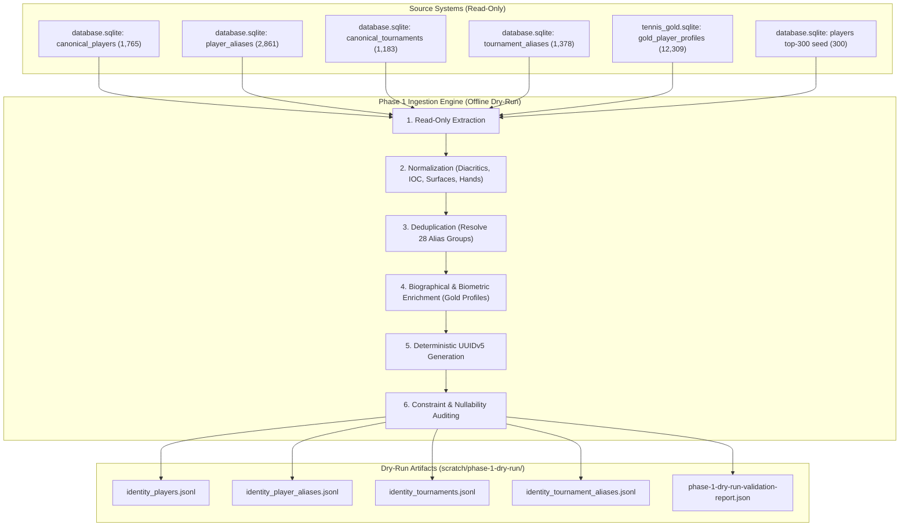

# Phase 1 Ingestion Pipeline & Seed Data Specification

**Status:** DRAFT-ONLY / DRY-RUN SPECIFICATION
**Target Schema:** `G:/telegram-backend/postgresSchemaV1.sql`
**Active Branch:** `staging/phase-1-ingestion-spec`
**Execution Environment:** OFFLINE / READ-ONLY SQLITE

---

## 1. Executive Summary & Phase 1 Objectives

The objective of **Phase 1: Ingestion Pipeline & Seed Data Specification** is to establish the complete deterministic transformation, extraction, and validation rules for populating the foundational PostgreSQL identity registries (`identity.players`, `identity.player_aliases`, `identity.tournaments`, `identity.tournament_aliases`) from the verified legacy SQLite databases without mutating any live systems.

### Invariant Safety Principles
1. **Zero Runtime Writes:** No writes, schema alterations, or vacuum operations against `data/database.sqlite` or `data/tennis_gold.sqlite`. All connections are opened with `{ readonly: true }`.
2. **Zero Database Connections:** No active connections to production or remote PostgreSQL instances.
3. **Deterministic Identity Resolution:** Primary keys in PostgreSQL use deterministic UUIDv5 algorithms so that dry-run outputs are 100% reproducible and verifiable offline.
4. **Zero Fabrication:** Missing biometrics, rankings, or dates are strictly preserved as `NULL`. No synthetic default zeros.

---

## 2. Ingestion Pipeline Lifecycle

---

## 3. Entity Resolution & Mapping Rules Summary

### 3.1 Players (`identity.players`)
* **Source Extraction:** 1,765 rows from `canonical_players`.
* **Biometric Enrichment:** Cross-referenced against `tennis_gold.sqlite: gold_player_profiles` (12,309 rows) via exact normalized name matching. Enriches `height_cm`, `weight_kg`, `birth_date` (from Unix timestamp), and `turned_pro_year`.
* **Slugs:** Normalized lowercase kebab-case strings generated for each player, guaranteed unique by suffixing on collision.
* **Country Normalization:** 132 distinct legacy country strings mapped to standardized 3-letter IOC codes.
* **Handedness Normalization:** Standardized to PostgreSQL enum `'R'`, `'L'`, `'Ambi'`, `'Unknown'`.

### 3.2 Player Aliases (`identity.player_aliases`)
* **Source Extraction:** 2,861 rows from `player_aliases`.
* **Deduplication:**
  * 27 same-player duplicate token groups collapsed by retaining the accented display name.
  * 1 true conflict token (`jovic i`) resolved by decoupling the mistaken mapping to Dusan Lajovic and associating strictly with Iva Jovic, flagged with `has_sibling_conflict = TRUE, is_verified = FALSE`.
* **Target Output:** Exactly 2,833 deduplicated, conflict-annotated alias records satisfying `UNIQUE (source_name, normalized_token)`.
* **Reconciliation Note:** Legacy migration documentation previously cited 2,861 aliases. The canonicalized target dataset strictly produces 2,833 records because 28 duplicate groups (56 rows) are collapsed to enforce `uq_identity_player_aliases_source_token`. All downstream Phase 3 and Phase 4 reconciliation gates must verify against 2,833 records.

### 3.3 Tournaments (`identity.tournaments`)
* **Source Extraction:** 1,183 rows from `canonical_tournaments`.
* **Surface Normalization:** Uppercase strings (`HARD`, `CLAY`, `GRASS`) mapped to Title Case enum (`'Hard'`, `'Clay'`, `'Grass'`).
* **Levels & Tours:** Retains standardized tier strings (`GRAND_SLAM`, `MASTERS_1000`, `ATP_500`, etc.) and tour enums (`'ATP'`, `'WTA'`).
* **Target Output:** Exactly 1,183 tournament records satisfying `UNIQUE (name_standard, tour)`.

### 3.4 Tournament Aliases (`identity.tournament_aliases`)
* **Source Extraction:** 1,378 rows from `tournament_aliases`.
* **Deduplication:** 2 whitespace/casing duplicate groups collapsed into single authoritative records.
* **Target Output:** Exactly 1,376 deduplicated alias records satisfying `UNIQUE (source_name, normalized_token)`.

---

## 4. Dry-Run Quality & Invariant Gates

The offline dry-run runner enforces the following automated pass/fail invariant checks:

| Gate # | Invariant Rule | Target Threshold | Fail Action |
| :--- | :--- | :--- | :--- |
| **G1** | Player Primary Key Uniqueness | 100% Unique UUIDs | Abort execution |
| **G2** | Player Slug Uniqueness | 100% Unique Slugs | Suffix disambiguator |
| **G3** | Player Gender Enum Validity | 100% in (`'M'`, `'F'`, `'MIXED'`) | Abort execution |
| **G4** | Player Biometric Sanity | $140 \le \text{height} \le 230$, $40 \le \text{weight} \le 140$ | Sanitize out-of-range to NULL |
| **G5** | Tournament Surface Enum Validity | 100% in (`'Hard'`, `'Clay'`, `'Grass'`, `'Carpet'`, `'Unknown'`) | Abort execution |
| **G6** | Tournament Natural Key Uniqueness | 100% Unique `(name_standard, tour)` | Abort execution |
| **G7** | Player Alias Foreign Key Integrity | 100% Aliases resolve to valid `player_id` | Reject orphan aliases |
| **G8** | Tournament Alias Foreign Key Integrity | 100% Aliases resolve to valid `tournament_id` | Reject orphan aliases |
| **G9** | Alias Token Uniqueness | 0 Duplicates per `(source_name, normalized_token)` | Abort execution |
| **G10**| Zero SQLite Mutation | DB checksums / byte size identical before and after run | Critical Failure |

---

## 5. Output Data Formats

Outputs are saved in JSON Lines format (`.jsonl`) under `scratch/phase-1-dry-run-output/` or `data/phase-1-dry-run-output/`:
* `identity_players.jsonl`: One JSON object per player, matching `identity.players` schema columns.
* `identity_player_aliases.jsonl`: One JSON object per alias, with resolved foreign key `player_id`.
* `identity_tournaments.jsonl`: One JSON object per tournament, matching `identity.tournaments` schema columns.
* `identity_tournament_aliases.jsonl`: One JSON object per alias, with resolved foreign key `tournament_id`.
* `phase-1-dry-run-validation-report.json`: Machine-readable summary of extraction metrics, enrichment rates, and audit results.
* `phase-1-dry-run-validation-report.md`: Human-readable markdown audit report.
