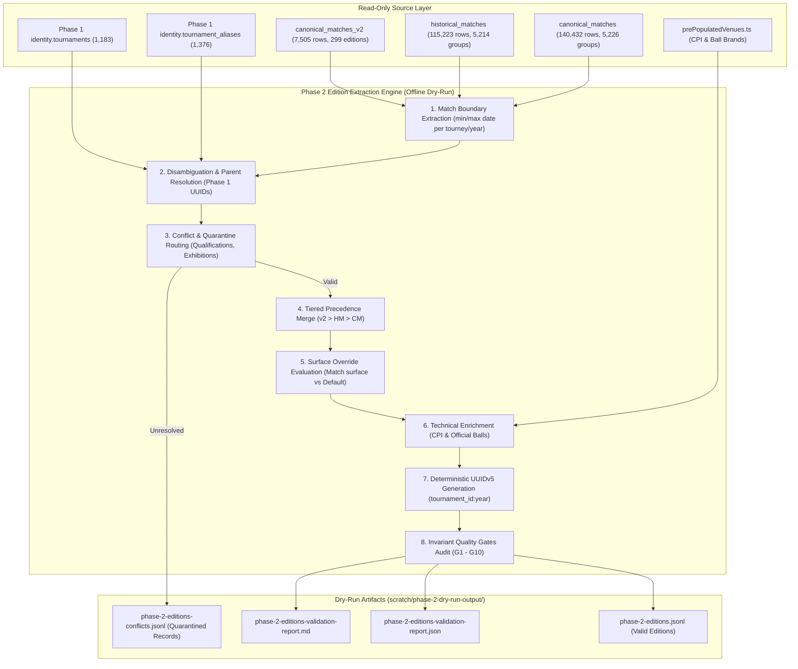

# Phase 2 Ingestion Pipeline & Seed Data Specification: Tournament Editions

**Status:** DRAFT-ONLY / DRY-RUN SPECIFICATION
**Target Schema:** `competition.tournament_editions` (in `G:/telegram-backend/postgresSchemaV1.sql`)
**Active Branch:** `staging/phase-1-ingestion-spec`
**Execution Environment:** OFFLINE / READ-ONLY SQLITE
**Parent Dependency:** Frozen Phase 1 `identity.tournaments` registry (`commit 19660b1`)

---

## 1. Executive Summary & Objectives

The goal of **Phase 2: Tournament Editions & Calendars Ingestion** is to establish the deterministic extraction, aggregation, surface override resolution, and validation pipeline for populating `competition.tournament_editions` for the 2021 through 2026 professional seasons.

### Invariant Safety Principles:
1. **Zero Database Connections:** Offline dry-run only. Zero queries against PostgreSQL.
2. **Read-Only SQLite:** Connections opened strictly with `{ readonly: true, fileMustExist: true }`. Byte sizes verified before and after execution.
3. **Deterministic Parent Linking:** Every non-quarantined edition must strictly resolve its parent `tournament_id` to an approved Phase 1 tournament UUID.
4. **Zero Fabrication:** Unknown draw sizes, unproven surfaces, and unmeasured CPI scores are preserved as authentic `NULL` values. Legacy placeholder zeros (`draw_size = 0`) are sanitized to `NULL`.
5. **Deterministic PKs:** Primary keys (`edition_id`) are generated via RFC 4122 UUIDv5 using namespace `6ba7b814-9dad-11d1-80b4-00c04fd430c8`.

---

## 2. Ingestion Pipeline Lifecycle

---

## 3. Invariant Quality Gates (G1 - G10)

The offline dry-run runner enforces the following automated pass/fail invariant checks:

| Gate # | Invariant Rule | Target Threshold | Fail Action |
| :--- | :--- | :--- | :--- |
| **G1** | Parent Tournament Resolution | 100% of non-quarantined editions resolve to a Phase 1 tournament UUID | Abort execution |
| **G2** | Edition Identity Uniqueness | 100% Unique `(tournament_id, year)` pairs | Abort execution |
| **G3** | Deterministic UUIDv5 Keys | 100% Reproducible UUIDs generated via RFC 4122 UUIDv5 | Abort execution |
| **G4** | Valid Calendar Years | 100% of editions have `year IN (2021, 2022, 2023, 2024, 2025, 2026)` | Abort execution |
| **G5** | Temporal Chronology Order | 100% of editions satisfy `start_date <= end_date` | Abort execution |
| **G6** | Surface Enum Validity | 100% in (`'Hard'`, `'Clay'`, `'Grass'`, `'Carpet'`, `'Unknown'`) | Abort execution |
| **G7** | Draw Size Sanity & Zero-Fabrication | Draw size is `NULL` or an integer in valid range `[4, 128]` (never `<= 0`) | Sanitize invalid to NULL |
| **G8** | Non-Collapsing Disambiguation | No distinct tournament sources silently merged into incorrect tournaments | Quarantine ambiguous |
| **G9** | Comprehensive Conflict Emitting | 100% of unresolved/qualification sources emitted to `phase-2-editions-conflicts.jsonl` | Audit failure |
| **G10**| Zero SQLite Mutation Guarantee | Source SQLite file byte sizes identical before and after run | Critical Failure |

---

## 4. Schema Audit & Observations on `postgresSchemaV1.sql`

During the Phase 2 analysis of `competition.tournament_editions` against real-world legacy data, the following schema constraint considerations were identified:

1. **Date Nullability (`start_date DATE NOT NULL, end_date DATE NOT NULL`):**
   * In `postgresSchemaV1.sql`, `start_date` and `end_date` are defined as `NOT NULL`.
   * **Data Reality:** For all active tournaments with played matches, `min(match_date)` and `max(match_date)` provide authentic dates.
   * **Caution:** If speculative future tournament editions (e.g. unplayed 2026 calendar placeholders) are introduced in future stages without confirmed schedule dates, the `NOT NULL` constraint would require either dummy placeholder dates (violating zero-fabrication) or schema adjustment to allow `NULLABLE` dates until scheduled. In this Phase 2 pipeline, only editions with proven match fixtures are populated, satisfying `NOT NULL` with 100% authenticity.
2. **Actual Surface Nullability (`actual_surface competition.surface_type NOT NULL`):**
   * Satisfied cleanly by inheriting the parent tournament's verified `default_surface` when match-level overrides are absent, or using `'Unknown'` if completely unproven.
3. **Draw Size Check Constraint (`draw_size SMALLINT NULL CHECK (draw_size IS NULL OR draw_size > 0)`):**
   * Perfectly aligns with our zero-fabrication rule sanitizing legacy placeholder `0` values to `NULL`.

---

## 5. Output Data Specifications

All artifacts are emitted to `scratch/phase-2-dry-run-output/`:
* `phase-2-editions.jsonl`: One JSON object per valid edition matching `competition.tournament_editions` schema.
* `phase-2-editions-conflicts.jsonl`: One JSON object per quarantined candidate (qualifications, exhibitions, unmapped sponsor strings) with diagnostic reasoning.
* `phase-2-editions-validation-report.json`: Machine-readable audit payload including gate results, counts, and year breakdowns.
* `phase-2-editions-validation-report.md`: Human-readable markdown audit report.
