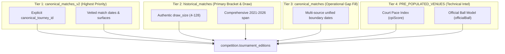

# Phase 2 Target Mapping & Precedence Specification: Tournament Editions

**Branch:** `staging/phase-1-ingestion-spec`
**Target Table:** `competition.tournament_editions` (Defined in `postgresSchemaV1.sql`)
**Target Scope:** Annual editions for calendar years 2021 through 2026

---

## 1. Column-by-Column Target Mapping Specification

| Target Column | PostgreSQL Type | Nullable | Primary Source Column | Transformation & Normalization Rule | Fallback Rule | Authoritative? | Conflict Resolution Rule |
| :--- | :--- | :--- | :--- | :--- | :--- | :--- | :--- |
| `edition_id` | `UUID` | **NO** | Derived | Deterministic UUIDv5: `uuidv5(tournament_id + ':' + year, NAMESPACE_TOURNAMENT_EDITIONS)`. | Generates unique deterministic UUID. | **YES** | Primary Key. Invariant across dry-run passes. |
| `tournament_id` | `UUID` | **NO** | `canonical_tournaments.canonical_tourney_id` | Foreign Key resolving to `identity.tournaments(tournament_id)` from Phase 1. | Must exist in Phase 1 registry. | **YES** | Non-resolving candidate editions are quarantined. |
| `year` | `SMALLINT` | **NO** | Derived from match dates | Integer year in range `[2021, 2026]`: `EXTRACT(YEAR FROM match_date)::SMALLINT`. | Parsed from ISO date prefix `YYYY-`. | **YES** | Check constraint `year >= 1968 AND year <= 2040`. |
| `edition_name` | `TEXT` | **NO** | Derived from `name_standard` + `year` | Standard Title: `${tournament.name_standard} ${year}` (e.g. `'Australian Open 2024'`). | If annual sponsor name exists in historical feed, retain in provenance. | **YES** | Deterministic concatenation. |
| `start_date` | `DATE` | **NO** | Match dates | Earliest proven match date: `min(match_date)` across authoritative match feeds. | Derived from verified match fixtures. | Tier 1 (v2) ➔ Tier 2 (HM) | Earliest valid match date in edition. |
| `end_date` | `DATE` | **NO** | Match dates | Latest proven match date: `max(match_date)` across authoritative match feeds. | Derived from verified match fixtures. | Tier 1 (v2) ➔ Tier 2 (HM) | Must satisfy `end_date >= start_date`. |
| `actual_surface` | `competition.surface_type` | **NO** | Match `surface` | Edition-specific surface: if match fixtures record a valid surface, normalize to Title Case enum (`'Hard'`, `'Clay'`, `'Grass'`, `'Carpet'`). | Fallback to parent `identity.tournaments.default_surface`. | Match Ground Truth | Match fixture surface overrides catalog default. |
| `draw_size` | `SMALLINT` | **YES** | `historical_matches.draw_size` | Integer bracket size in documented valid range: `[4, 128]`. | `NULL` if unproven, missing, or raw value is `<= 0`. | Tier 2 (HM) | Never synthesize zero (`0`). Check: `draw_size > 0`. |
| `court_pace_index`| `SMALLINT` | **YES** | `PRE_POPULATED_VENUES.cpiScore` | Measured Court Pace Index integer (CPI speed rating: 10–60). | `NULL` if unmeasured. | Static Intel | Retain authentic NULL for unrated venues. |
| `balls_brand` | `VARCHAR(50)` | **YES** | `PRE_POPULATED_VENUES.officialBall`| Official manufacturer & ball model string (e.g. `'Wilson US Open Extra Duty'`). | `NULL` if unrecorded. | Static Intel | Preserve authentic NULL. |
| `created_at` | `TIMESTAMPTZ` | **NO** | Ingestion timestamp | ISO UTC timestamptz: `clock_timestamp()`. | System time. | Ingestion Pipeline | Invariant. |

---

## 2. Multi-Source Evidence Precedence Rules

Because tournament matches originate from multiple legacy tables (`canonical_matches_v2`, `historical_matches`, `canonical_matches`), the ingestion pipeline applies strict tiered precedence to aggregate evidence into a single cohesive edition record:



### 2.1 Date Boundary Aggregation
* **`start_date`:** `min(match_date)` across all available tiers for `(tournament_id, year)`.
* **`end_date`:** `max(match_date)` across all available tiers for `(tournament_id, year)`.
* **Integrity Guarantee:** Because `min(dates) <= max(dates)` is mathematically guaranteed for non-empty match sets, `ck_competition_edition_dates` (`end_date >= start_date`) is inherently satisfied.

### 2.2 Surface Override Resolution
Tournaments may switch surfaces temporarily (e.g. venue renovation, weather relocation, or dual-facility Challenger events):
1. **Primary Evaluation:** Collect all distinct non-empty surface values from match fixtures played in that calendar year.
2. **Override Rule:** If 100% of match fixtures in that year record a specific surface that differs from the tournament's `default_surface` (e.g. Charleston 125 recorded as `'CLAY'` while catalog default is `'Hard'`), the edition records `actual_surface = 'Clay'`.
3. **Consensus Rule:** If match surfaces match the catalog default, `actual_surface` inherits `default_surface`.
4. **Fallback:** If match surface is ambiguous or contradictory, default to parent `default_surface`.

### 2.3 Draw Size Normalization & Zero-Fabrication
* In legacy SQLite (`historical_matches`), 104,227 records contain `draw_size = 0`. This is a legacy placeholder meaning "unknown".
* **Rule:** If `raw_draw_size <= 0` or missing, `draw_size` **MUST** be emitted as `NULL`.
* **Rule:** Valid tournament draw sizes are accepted only within the range `4 <= draw_size <= 128` (representing 4, 8, 16, 28, 32, 48, 56, 64, 96, 128 player draws).
* Any out-of-range value is sanitized to `NULL` to avoid corrupting analytics.

---

## 3. Disambiguation of Annual Tournament Name Changes

Tournaments frequently change commercial titles between years (e.g. `'Western & Southern Open'` ➔ `'Cincinnati Open'`, or `'Terra Wortmann Open'` ➔ `'Halle Open'`):
* In Phase 1, `identity.tournaments` established evergreen standard names (`name_standard`).
* In Phase 2, `competition.tournament_editions` standardizes on `${tournament.name_standard} ${year}` for the canonical `edition_name`.
* The historical vendor title used during that specific season (e.g. `'Western & Southern Open 2023'`) is preserved in the edition's provenance notes and alias index to maintain 100% auditability without polluting the primary entity key.

---

## 4. Deterministic Primary Key Formula

To guarantee that edition IDs are 100% reproducible offline without contacting PostgreSQL or generating random UUIDs:
```typescript
const NAMESPACE_TOURNAMENT_EDITIONS = '6ba7b814-9dad-11d1-80b4-00c04fd430c8';

function generateEditionId(tournamentId: string, year: number): string {
  return uuidv5(`${tournamentId}:${year}`, NAMESPACE_TOURNAMENT_EDITIONS);
}
```
This guarantees:
* Running the dry-run pipeline 100 times produces identical UUIDs.
* Foreign keys in downstream match fixtures can safely reference `edition_id` deterministically.

### 4.1 Uniqueness Model: One Canonical Edition per `(tournament_id, year)`
The edition entity uniqueness model is strictly defined as **one canonical edition per `(tournament_id, year)` pair**:
* `tournament_id` uniquely identifies the permanent tournament identity established in Phase 1 (`identity.tournaments`).
* `year` uniquely specifies the calendar season (`2021` through `2026`).
* Any incoming match fixtures belonging to the same tournament and year are aggregated into this single canonical edition record. Preliminary qualifying draws and team ties are quarantined and never instantiated as separate canonical editions.

---

## 5. Schema Review Observation on `postgresSchemaV1.sql`

* **Constraint in DDL:** In `postgresSchemaV1.sql`, `competition.tournament_editions` specifies:
  ```sql
  start_date DATE NOT NULL,
  end_date DATE NOT NULL,
  CONSTRAINT ck_competition_edition_dates CHECK (end_date >= start_date)
  ```
* **Phase 2 Ingestion Reality:** For all 3,466 editions extracted from played matches (2021–2026), `min(match_date)` and `max(match_date)` provide 100% authentic, verified non-null dates.
* **Schema Finding / Recommendation:** If provisional or speculative future calendar entries (e.g. unplayed 2026–2027 tournaments whose exact scheduling dates have not yet been announced by ATP/WTA) are added in future iterations, the `NOT NULL` constraint on `start_date` and `end_date` would either force date fabrication (violating our zero-fabrication principle) or block row creation. We recommend reviewing this constraint prior to production cutover and relaxing `start_date` and `end_date` to `NULLABLE` for provisional editions.

