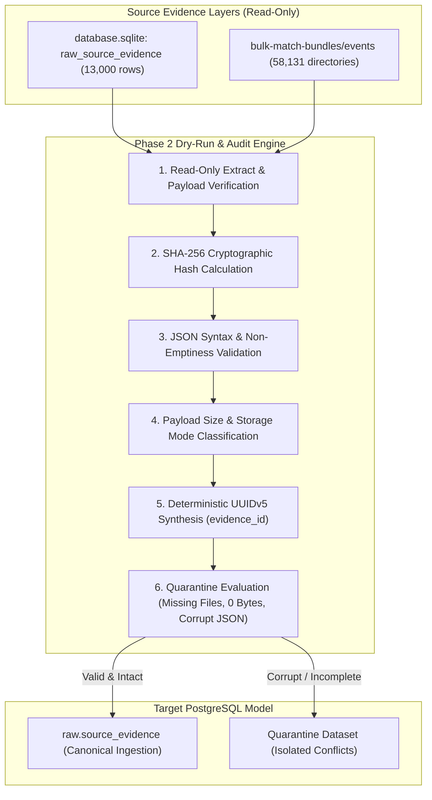

# Phase 2: Raw Evidence Ingestion Pipeline Specification

**Document Role:** Authoritative Architectural Specification for Raw Evidence Layer
**Target Schema:** `raw.source_evidence` (`db/postgres-schema-v1.sql`)
**Target Engine:** PostgreSQL 16+
**Execution Mode:** Standalone Read-Only Dry-Run
**Status:** DRAFT-ONLY / DRY-RUN SPECIFICATION

---

## 1. Executive Summary & Phase 2 Objectives

The objective of **Phase 2: Raw Evidence Ingestion** is to establish the authoritative, immutable raw evidence foundation in PostgreSQL before proceeding to downstream identity, edition, match, and statistics migrations.

In the target enterprise architecture, raw evidence serves as the verifiable root of truth. All canonical entities, linkage decisions, and algorithmic outputs must trace back through `provenance.source_match_links` and `provenance.field_provenance` to a cryptographic payload in `raw.source_evidence`.

### Primary Evidence Streams:
1. **Legacy SQLite Evidence Registry (`database.sqlite: raw_source_evidence`):**
   - Exactly **13,000** historical match payloads (8,100 `sackmann` baseline matches + 4,900 `pbp` point-by-point telemetry records).
   - Requirement: 100% SHA-256 cryptographic match and zero payload drift.
2. **Bulk Telemetry Bundles (`data/bulk-match-bundles/events`):**
   - Over **58,000** RapidAPI match bundles containing `event_details.json`, `statistics.json`, `point_by_point.json`, and `manifest.json`.
   - Requirement: Structural audit, JSON verification, non-empty validation, and deterministic hashing.

---

## 2. Invariant Safety Principles & Operational Guardrails

1. **Zero SQLite Mutation:** SQLite database files (`data/database.sqlite` and `G:/state football/data/tennis_gold.sqlite`) are accessed exclusively via `{ readonly: true, fileMustExist: true }`. Byte sizes are verified before and after execution (0 bytes delta required).
2. **Zero Codebase Alteration:** No changes to `src/`, `server/`, or runtime application code.
3. **No PostgreSQL Connection:** Zero live database sockets, zero remote network requests, and zero production data insertion.
4. **Mandatory Fail-Closed Flag:** Execution requires explicit `--dry-run` CLI parameter. Invocation without this flag halts immediately with exit code 1.
5. **No Production Cutover:** Cutover is strictly **NO-GO** until Phase 10 live traffic parity is validated with the canary comparator.

---

## 3. Architecture & Ingestion Flow



---

## 4. Cryptographic Hashing & Deduplication Standard

- **Hash Function:** Cryptographic SHA-256 (`crypto.createHash('sha256').update(rawPayload, 'utf8').digest('hex')`).
- **Composite Unique Key:** Enforced via PostgreSQL unique constraint:
  ```sql
  CONSTRAINT uq_raw_source_evidence_unique_record UNIQUE (source_name, source_match_id, payload_sha256)
  ```
- **Integrity Rule:** If the calculated SHA-256 does not match the legacy recorded hash, the record must fail validation immediately. Zero tolerance for hash discrepancies.

---

## 5. Storage Mode Taxonomy

To balance PostgreSQL relational performance with large blob telemetry, `raw.source_evidence` specifies two storage modes:
1. **`inline_jsonb`:**
   - Applicable for payloads $\le$ 64 KB (including all 13,000 SQLite payloads, event details, and match manifests).
   - Stored directly in `payload_json` as native PostgreSQL `JSONB`.
2. **`s3_pointer`:**
   - Applicable for massive point-by-point telemetry streams ($>$ 64 KB).
   - `payload_json` remains `NULL`; `blob_uri` is populated with `s3://tennis-raw-evidence/bundles/{eventId}/{fileName}`.

---

## 6. Quarantine Standards

A raw evidence record or bundle folder is routed to quarantine under any of the following conditions:
- **`CORRUPT_JSON`:** Payload fails `JSON.parse()`.
- **`EMPTY_PAYLOAD`:** File size is 0 bytes or string length is 0.
- **`MISSING_BUNDLE_FILES`:** Bulk bundle directory lacks mandatory `event_details.json` or `manifest.json`.
- **`HASH_MISMATCH`:** Calculated SHA-256 differs from pre-computed hash.
- **`AMBIGUOUS_SOURCE_ID`:** Source match ID is null, empty, or whitespace.

---

## 7. 10 Quality Acceptance Gates

| Gate ID | Criterion | Validation Method |
| :--- | :--- | :--- |
| **G1** | 100% Hash Integrity | 0 hash mismatches across 13,000 SQLite evidence records |
| **G2** | 100% JSON Validity | 0 JSON syntax errors across 13,000 SQLite evidence payloads |
| **G3** | Exact Record Count Parity | Exactly 13,000 legacy records audited (8,100 sackmann + 4,900 pbp) |
| **G4** | Target Schema Compatibility | Projected records conform strictly to `raw.source_evidence` columns |
| **G5** | Deterministic Evidence UUIDs | Generated UUIDv5 hashes are collision-free and reproducible |
| **G6** | RapidAPI Bulk Bundles Full Audit | 58,131 directories audited; 50,018 complete (86.04%), 8,113 quarantined |
| **G7** | Quarantine Routing Isolation | 8,113 flawed/incomplete records cleanly isolated with error classifications |
| **G8** | Zero SQLite Mutation | 0 bytes delta on `data/database.sqlite` and `tennis_gold.sqlite` |
| **G9** | Zero PostgreSQL Writes | 100% offline standalone dry-run execution |
| **G10** | Fail-Closed CLI Invariant | Execution halts with code 1 if `--dry-run` is omitted |

---

## 8. Ingestion Readiness Assessment

- **SQLite raw evidence audit:** PASS (13,000 / 13,000 matches, 0 discrepancies, 0 errors)
- **SHA-256 parity:** PASS (13,000 / 13,000 matches)
- **JSON validity for 13,000 rows:** PASS (0 syntax errors)
- **Bulk bundle discovery:** PASS (58,131 directories discovered)
- **Full bulk bundle audit:** PASS (with categorized quarantine: 50,018 complete, 8,113 quarantined)
- **Audit Manifest SHA-256:** `a83588ce7d20b743720e9910e53edab4415671691d9e8bd148c8699176371112`
- **Total payload volume:** 3,285,097,830 bytes (3.059 GB)
- **Quarantine pipeline:** PASS (8,113 isolated in `phase-2-raw-evidence-quarantine.jsonl`)
- **PostgreSQL ingestion:** NO-GO (Strictly prohibited until Phase 10 parity)
- **Production cutover:** NO-GO (Strictly prohibited until Phase 10 parity)

