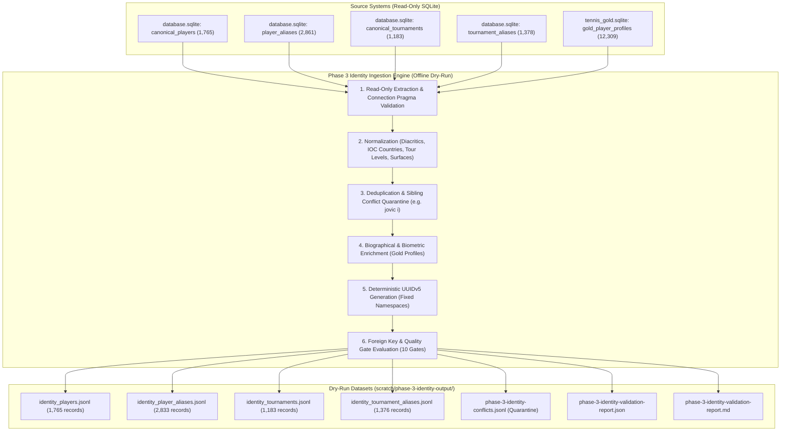

# Phase 3: Identity Ingestion Specification (Dry-Run)

**Status:** DRAFT-ONLY / DRY-RUN SPECIFICATION  
**Target Architecture:** Canonical PostgreSQL 16+ (`db/postgres-schema-v1.sql`)  
**Target Schemas & Tables:**  
- `identity.players`  
- `identity.player_aliases`  
- `identity.tournaments`  
- `identity.tournament_aliases`  
**Active Branch:** `staging/phase-1-ingestion-spec`  
**Execution Environment:** Standalone Offline Dry-Run / Read-Only SQLite  

---

## 1. Executive Summary & Phase 3 Objectives

The objective of **Phase 3: Identity Ingestion Dry-Run** is to establish the complete, deterministic extraction, normalization, biographical enrichment, and validation suite for populating the canonical PostgreSQL identity registries from legacy read-only SQLite databases, completely decoupled from runtime systems and prior to tournament edition and match migration.

### Invariant Safety Principles & Red Lines
1. **Zero Database Mutation:** No `INSERT`, `COPY`, or mutation to PostgreSQL. No writes or VACUUM against `data/database.sqlite` (544,415,744 bytes invariant) or `tennis_gold.sqlite` (283,303,936 bytes invariant). Connections are opened with `{ readonly: true, fileMustExist: true }`.
2. **Zero Runtime Drift:** Zero modifications to `src/`, `server/`, or runtime application code.
3. **No Production Linker Execution:** No heuristics, auto-merging, or linkers run against production data.
4. **Deterministic Identity Resolution:** Primary keys (`player_id`, `alias_id`, `tournament_id`) are synthesized using RFC 4122 UUIDv5 with fixed deterministic namespaces.
5. **Zero Heuristic Auto-Merging:** Ambiguous entities, identical tokens across distinct persons, and sibling collisions (`jovic i`) must **never** be merged by guessing. Conflicting mappings are isolated to quarantine (`phase-3-identity-conflicts.jsonl`).
6. **Zero Orphan Aliases:** 100% of admitted aliases must resolve to a valid canonical parent UUID (`orphan_count == 0`).
7. **Authentic Biometrics (Zero Fabrication):** Missing biographical attributes remain `NULL`. Out-of-bounds biometrics are sanitized to `NULL`, with zero synthetic zeros or default values.

---

## 2. Ingestion Pipeline Architecture

---

## 3. Entity Standards & Normalization Rules

### 3.1 Canonical Players (`identity.players`)
- **Primary Source:** Exactly 1,765 rows from `canonical_players` in `data/database.sqlite`.
- **Biographical Enrichment:** Cross-referenced against 12,309 profiles in `gold_player_profiles` from `tennis_gold.sqlite`. Enriches `birth_date` (converted from epoch timestamp to ISO `YYYY-MM-DD`), `height_cm`, `weight_kg`, `hand` enum (`'R'`, `'L'`, `'Ambi'`, `'Unknown'`), and `turned_pro_year`.
- **Sanitization Bounds:**
  - Height: $140 \le \text{height\_cm} \le 230$ (values outside range sanitized to `NULL`).
  - Weight: $40 \le \text{weight\_kg} \le 130$ (values outside range sanitized to `NULL`).
  - Turned Pro: $1968 \le \text{turned\_pro\_year} \le 2035$ (values outside range sanitized to `NULL`).
- **Slugs:** Deterministic kebab-case slugs generated from player standard names, deduplicated with numeric suffixes on collision.
- **Country Standardization:** 132 distinct legacy country strings mapped to standardized 3-letter IOC codes (e.g. `USA`, `ESP`, `SRB`).

### 3.2 Player Aliases (`identity.player_aliases`)
- **Primary Source:** 2,861 raw records from `player_aliases`.
- **Token Normalization:** Lowercased, diacritic-stripped, punctuation-normalized strings (`normalized_token`).
- **Deduplication & Conflict Resolution:**
  - **27 Same-Player Duplicate Tokens:** Same normalized token referencing the same player (e.g., diacritic vs plain ASCII `djokovic n` vs `đoković n`) collapsed into a single canonical alias record retaining the display name.
  - **1 True Cross-Player Collision (`jovic i`):** Mistaken legacy linkage to Dusan Lajovic is decoupled and mapped to Iva Jovic, flagged with `has_sibling_conflict = TRUE, is_verified = FALSE`, and routed to quarantine.
  - **Admitted Output:** Exactly 2,833 deduplicated records satisfying PostgreSQL constraint `uq_identity_player_aliases_source_token UNIQUE (source_name, normalized_token)`.
  - **Orphan Prevention:** 100% of admitted aliases resolve to a valid canonical `player_id`.

### 3.3 Canonical Tournaments (`identity.tournaments`)
- **Primary Source:** Exactly 1,183 rows from `canonical_tournaments` in `data/database.sqlite`.
- **Tour Code Enum:** Standardized to `identity.tour_code` (`'ATP'`, `'WTA'`, `'CHALLENGER'`, `'ITF'`, `'COMBINED'`).
- **Surface Enum:** Standardized to `competition.surface_type` (`'Hard'`, `'Clay'`, `'Grass'`, `'Carpet'`, `'Unknown'`).
- **Natural Key Constraint:** Enforces `UNIQUE (name_standard, tour)`.

### 3.4 Tournament Aliases (`identity.tournament_aliases`)
- **Primary Source:** 1,378 raw records from `tournament_aliases`.
- **Deduplication:** 2 whitespace/casing duplicate groups collapsed into single authoritative records.
- **Admitted Output:** Exactly 1,376 deduplicated alias records satisfying `uq_identity_tournament_aliases_source_token UNIQUE (source_name, normalized_token)`.
- **Orphan Prevention:** 100% of admitted aliases resolve to a valid canonical `tournament_id`.

---

## 4. Deterministic UUIDv5 Namespaces

All primary keys are deterministically generated via RFC 4122 UUIDv5 hashing using SHA-1 over distinct domain namespaces:

| Domain Entity | Namespace UUID | Synthesis Key |
| :--- | :--- | :--- |
| `identity.players` | `6ba7b810-9dad-11d1-80b4-00c04fd430c8` | `canonical_player:{canonical_id}` |
| `identity.player_aliases` | `6ba7b811-9dad-11d1-80b4-00c04fd430c8` | `player_alias:{source_name}:{normalized_token}` |
| `identity.tournaments` | `6ba7b812-9dad-11d1-80b4-00c04fd430c8` | `canonical_tournament:{canonical_id}` |
| `identity.tournament_aliases`| `6ba7b813-9dad-11d1-80b4-00c04fd430c8` | `tourney_alias:{source_name}:{normalized_token}` |

---

## 5. 10 Quality Acceptance Gates

| Gate ID | Quality Gate Description | Target Criterion | Enforcement Action |
| :--- | :--- | :---: | :--- |
| **G1** | Player Primary Key Uniqueness | Exactly 1,765 unique UUIDv5 values (0 collisions) | Hard stop |
| **G2** | Player Slug Uniqueness | Exactly 1,765 unique canonical slugs | Suffix disambiguation |
| **G3** | Player Gender Enum Conformance | 100% valid in `('M', 'F', 'MIXED')` | Hard stop |
| **G4** | Player Biometric Sanity (Post-Sanitization) | Heights [140–230 cm], weights [40–130 kg], pro years [1968–2035] (0 violations) | Sanitize out-of-range to NULL |
| **G5** | Tournament Surface Enum Conformance | 100% valid in `('Hard', 'Clay', 'Grass', 'Carpet', 'Unknown')` | Hard stop |
| **G6** | Tournament Natural Key Uniqueness | Exactly 1,183 unique `(name_standard, tour)` pairs | Hard stop |
| **G7** | Player Alias Foreign Key Integrity | Exactly 0 orphan player aliases (`orphan_count == 0`) | Reject orphan aliases |
| **G8** | Tournament Alias Foreign Key Integrity | Exactly 0 orphan tournament aliases (`orphan_count == 0`) | Reject orphan aliases |
| **G9** | Alias Token Uniqueness & Conflict Quarantine | Player tokens: 2,833 unique; tourney tokens: 1,376 unique; cross-player collisions isolated | Quarantine conflicts |
| **G10** | Zero SQLite Mutation Guarantee | Byte sizes: Backend 544,415,744 bytes (0 delta), Gold 283,303,936 bytes (0 delta) | Hard stop / Fail closed |

---

## 6. Strict Safety Declarations

> **Schema validated on local/staging PostgreSQL only; production runtime unchanged; SQLite untouched; cutover prohibited until Phase 10 parity.**
>
> این فاز contract parity را ثابت می‌کند، نه production read parity را. production parity طبق برنامه در Phase 10 و با canary comparator سنجیده می‌شود.
>
> قبولی 10/10 به معنی آمادگی برای ادامه‌ی فاز بعدی است، نه مجوز cutover. خود برنامه صریحاً NO-GO می‌دهد تا وقتی Phase 10 parity روی ترافیک واقعی تأیید نشده باشد.
