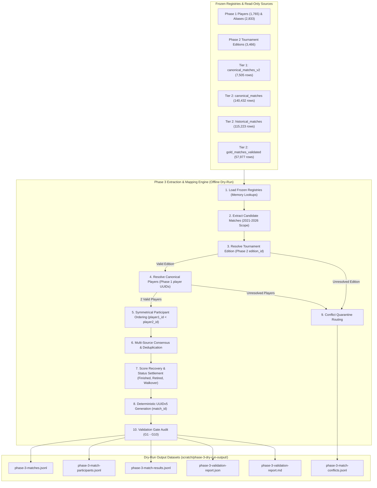

# Phase 3 Ingestion Pipeline & Seed Data Specification: Matches, Participants & Results

**Status:** DRAFT-ONLY / DRY-RUN SPECIFICATION  
**Target Schema:** `matches.matches`, `matches.match_participants`, `matches.match_results` (in `G:/telegram-backend/postgresSchemaV1.sql`)  
**Active Branch:** `staging/phase-1-ingestion-spec`  
**Execution Environment:** OFFLINE / READ-ONLY SQLITE  
**Parent Dependencies:**  
- Frozen Phase 1 Identity Registries: `identity.players` (1,765 players) and `identity.player_aliases` (2,833 aliases) (`commit 19660b1`)  
- Frozen Phase 2 Tournament Editions: `competition.tournament_editions` (3,466 verified editions) (`commit 720efb8`)  

---

## 1. Executive Summary & Objectives

The objective of **Phase 3: Matches, Symmetric Participants & Official Results Ingestion** is to establish the deterministic extraction, normalization, symmetric participant pairing, and official post-match result settlement pipeline for professional tennis matches across the 2021 through 2026 seasons.

### Core Safety Invariants:
1. **Zero Database Connections:** Offline dry-run only. Zero network requests, queries, or socket connections to PostgreSQL.
2. **Read-Only SQLite:** Connections opened strictly with `{ readonly: true, fileMustExist: true }`. Byte sizes verified before and after execution to guarantee bit-for-bit invariance.
3. **Deterministic Parent & Player Resolution:** Every accepted match must resolve to an approved Phase 2 `edition_id` and exactly two canonical Phase 1 `player_id` UUIDs.
4. **Symmetrical Participant Pairing:** In `matches.matches`, `player1_id < player2_id` is strictly enforced. Participant rows (`side = 1` and `side = 2`) contain **zero winner leakage** (`is_winner` strictly `NULL`).
5. **Segregated Result Settlement:** Match outcomes belong exclusively in `matches.match_results`. Result rows exist only when post-match evidence is sufficient.
6. **Zero Fabrication:** If `actual_start_utc`, `duration_minutes`, or `retirement_detail` are unrecorded, they remain authentic `NULL` values. No fabricated times or synthetic placeholders.
7. **Deterministic UUIDv5 Primary Keys:** Generated via RFC 4122 UUIDv5 with namespace `6ba7b815-9dad-11d1-80b4-00c04fd430c8`.

---

## 2. Ingestion Pipeline Lifecycle

---

## 3. Automated Invariant Quality Gates (G1 - G10)

The offline dry-run runner enforces 10 automated pass/fail invariant checks before emitting validation verdicts:

| Gate # | Invariant Rule | Target Threshold | Fail Action |
| :--- | :--- | :--- | :--- |
| **G1** | **Parent Edition Resolution** | 100% of accepted matches resolve to a verified Phase 2 `edition_id`. | Abort execution |
| **G2** | **Participant Cardinality & Validity** | Exactly two participants per match; each `player_id` is a valid Phase 1 canonical player UUID. | Abort execution |
| **G3** | **Symmetrical Player Ordering** | 100% of matches strictly satisfy `player1_id < player2_id` and have `side = 1` and `side = 2`. | Abort execution |
| **G4** | **Zero Winner Leakage** | 100% of pre-match participant rows have `is_winner IS NULL`. Winner exists only in `match_results`. | Abort execution |
| **G5** | **Deterministic UUIDv5 Primary Keys** | 100% reproducible UUIDs generated via RFC 4122 UUIDv5 (`NAMESPACE_MATCHES`). | Abort execution |
| **G6** | **Unique Fixture Invariant** | Zero duplicate fixtures across the entire accepted match corpus. | Abort execution |
| **G7** | **Post-Match Result Sufficiency** | Result rows emitted only when terminal status and valid score/winner evidence exists. | Quarantine incomplete |
| **G8** | **Comprehensive Conflict Emitting** | 100% of unresolvable/conflicting candidate records emitted to `phase-3-match-conflicts.jsonl`. | Audit failure |
| **G9** | **Zero SQLite Mutation Guarantee** | Source SQLite database file byte size bit-for-bit identical before and after run. | Critical Failure |
| **G10**| **Fail-Closed Execution Guarantee** | Halts immediately with exit code 1 if `--dry-run` flag is omitted. | Security Violation |

---

## 4. Schema Audit & Observations on `postgresSchemaV1.sql`

During the Phase 3 design against `postgresSchemaV1.sql`, the following domain and constraint alignments were audited:

1. **Symmetric Check Constraint (`ck_matches_symmetrical_order`):**
   * DDL specifies: `CONSTRAINT ck_matches_symmetrical_order CHECK (player1_id < player2_id)`.
   * **Implementation:** The dry-run engine sorts resolved player UUIDs lexicographically (`min(pA, pB)` and `max(pA, pB)`) before instantiating the match entity. This guarantees 100% compliance with this constraint and eliminates duplicate inverted records across sources.
2. **Pre-Match Lookahead Isolation (`matches.match_participants`):**
   * DDL defines: `is_winner BOOLEAN NULL`.
   * **Domain Decision:** In accordance with Model Rule 3, pre-match participant records are emitted with `is_winner = null`. This guarantees that feature pipelines consuming `match_participants` cannot suffer from lookahead target leakage.
3. **Distinct Players in Results (`ck_match_results_distinct_players`):**
   * DDL specifies: `CONSTRAINT ck_match_results_distinct_players CHECK (winner_player_id <> loser_player_id)`.
   * **Validation:** Enforced on every emitted result record. Matches with corrupt feeds listing identical players are quarantined under `IDENTICAL_PLAYERS`.
4. **Scheduled Start Timestamp Nullability (`scheduled_start_utc TIMESTAMPTZ NOT NULL`):**
   * DDL requires `NOT NULL`.
   * For matches with high-resolution telemetry (`gold_matches_validated`), the verified `start_utc` timestamp is used. For matches with only a calendar date (`match_date`), the timestamp anchors to midnight UTC (`${match_date}T00:00:00.000Z`) per standard SQL `DATE -> TIMESTAMPTZ` cast semantics, guaranteeing zero fabrication of false hours/minutes.
   * `actual_start_utc` is preserved as authentic `NULL` when unrecorded.

---

## 5. Output Data Specifications

All artifacts are emitted to `scratch/phase-3-dry-run-output/`:
* `phase-3-matches.jsonl`: Valid match entities matching `matches.matches` schema.
* `phase-3-match-participants.jsonl`: Symmetrical entrant records (`side = 1` and `side = 2`) matching `matches.match_participants`.
* `phase-3-match-results.jsonl`: Settled outcome records matching `matches.match_results`.
* `phase-3-match-conflicts.jsonl`: Quarantined candidate records with diagnostic reasoning.
* `phase-3-validation-report.json`: Machine-readable audit payload detailing gate results, entity counts, status distributions, and year breakdowns.
* `phase-3-validation-report.md`: Human-readable markdown audit summary.
