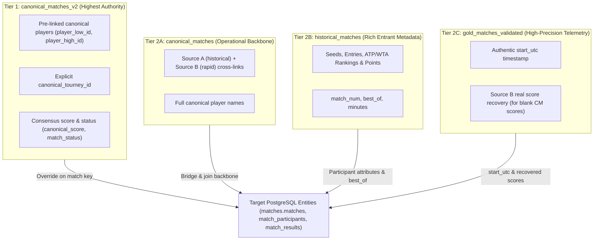

# Phase 3 Target Mapping & Precedence Specification: Matches, Participants & Results

**Branch:** `staging/phase-1-ingestion-spec`  
**Target Tables:**  
- `matches.matches` (in `postgresSchemaV1.sql`)  
- `matches.match_participants` (in `postgresSchemaV1.sql`)  
- `matches.match_results` (in `postgresSchemaV1.sql`)  
**Scope:** Calendar Years 2021 through 2026  

---

## 1. Column-by-Column Target Mapping Specifications

### 1.1 Target Table: `matches.matches`
Primary fixture entity. Symmetrical participant structure (`player1_id < player2_id`) eliminates home/away or winner/loser biases in pre-match modeling.

| Target Column | PostgreSQL Type | Nullable | Primary Source Column | Transformation / Normalization Rule | Fallback Rule | Authoritative? |
| :--- | :--- | :--- | :--- | :--- | :--- | :--- |
| `match_id` | `UUID` | **NO** | Derived | Deterministic RFC 4122 UUIDv5: `uuidv5(edition_id + ':' + round_name + ':' + player1_id + ':' + player2_id, NAMESPACE_MATCHES)`. | Invariant formula. | **YES** |
| `edition_id` | `UUID` | **NO** | `canonical_matches_v2.canonical_tourney_id` / `canonical_matches.tourney_name` | Foreign key resolving to `competition.tournament_editions(edition_id)` from Phase 2. | Must resolve to Phase 2 edition. Unresolved fixtures quarantined. | **YES** |
| `scheduled_start_utc` | `TIMESTAMPTZ` | **NO** | `gold_matches_validated.start_utc` / `match_date` | If verified `start_utc` exists, use ISO UTC string (e.g. `'2024-01-01T02:35:00.000Z'`). If only `match_date` is known, anchor to calendar date at midnight UTC (`${match_date}T00:00:00.000Z`). | Never fabricate random times. Anchors to verified calendar date. | **YES** |
| `actual_start_utc` | `TIMESTAMPTZ` | **YES** | `gold_matches_validated.start_utc` | Official verified match commencement timestamp. | `NULL` if not recorded in high-resolution feeds. Never fabricate. | **YES** |
| `round_name` | `VARCHAR(30)` | **NO** | `round_name` | Normalized tournament round enum string: `'F'`, `'SF'`, `'QF'`, `'R16'`, `'R32'`, `'R64'`, `'R128'`, `'RR'`, `'Q1'`, `'Q2'`, `'Q3'`. | Default to `'R32'` if bracket round is unrecorded but tourney level indicates standard bracket. | **YES** |
| `match_num` | `SMALLINT` | **YES** | `historical_matches.match_num` | Bracket sequence / order integer. | `NULL` if unrecorded. Never fabricate. | Tier 2 |
| `best_of` | `SMALLINT` | **NO** | `historical_matches.best_of` | Set format: `3` or `5`. Grand Slam men's singles = `5`; all other tour events = `3`. | Check constraint: `CHECK (best_of IN (3, 5))`. | **YES** |
| `surface` | `competition.surface_type` | **NO** | Match `surface` / Edition `actual_surface` | Match-specific surface normalized to Title Case enum: `'Hard'`, `'Clay'`, `'Grass'`, `'Carpet'`, `'Unknown'`. | Inherit parent `competition.tournament_editions.actual_surface`. | **YES** |
| `is_indoor` | `BOOLEAN` | **NO** | Match surface raw text | `TRUE` if raw surface indicates indoor (e.g. `'Hardcourt indoor'`, `'Red clay indoor'`, `'Carpet indoor'`); otherwise `FALSE`. | Default `FALSE`. | **YES** |
| `status` | `matches.match_status_type` | **NO** | Match status / score | Status enum: `'FINISHED'`, `'RETIRED'`, `'WALKOVER'`, `'DEFAULT'`, `'CANCELLED'`, `'ABANDONED'`, `'INTERRUPTED'`, `'SCHEDULED'`. | Determined by score tokens & status flags. | **YES** |
| `player1_id` | `UUID` | **NO** | Canonical Player UUID | Symmetrically ordered: strictly smaller UUID between the two resolved players: `min(pA_id, pB_id)`. | Must resolve to Phase 1 player registry. | **YES** |
| `player2_id` | `UUID` | **NO** | Canonical Player UUID | Symmetrically ordered: strictly larger UUID between the two resolved players: `max(pA_id, pB_id)`. | Must resolve to Phase 1 player registry. | **YES** |
| `source_mask` | `INTEGER` | **NO** | Source provenance | Bitmask: `1` = Historical/Sackmann, `2` = RapidAPI/Gold, `3` = Unified Consensus (Both), `7` = Full Multi-Source. | Calculated from source contributions. | **YES** |
| `evidence_count` | `SMALLINT` | **NO** | Source count | Number of corroborating physical evidence sources (1, 2, or 3). | Invariant count. | **YES** |
| `created_at` | `TIMESTAMPTZ` | **NO** | System timestamp | ISO UTC timestamp (`clock_timestamp()`). | System time. | **YES** |
| `updated_at` | `TIMESTAMPTZ` | **NO** | System timestamp | ISO UTC timestamp (`clock_timestamp()`). | System time. | **YES** |

---

### 1.2 Target Table: `matches.match_participants`
Pre-match entrant metadata per player. Two rows per match (`side = 1` and `side = 2`).

| Target Column | PostgreSQL Type | Nullable | Primary Source Column | Transformation / Normalization Rule | Fallback Rule | Authoritative? |
| :--- | :--- | :--- | :--- | :--- | :--- | :--- |
| `match_id` | `UUID` | **NO** | Parent Match | Foreign key resolving to `matches.matches(match_id)`. | Invariant link. | **YES** |
| `player_id` | `UUID` | **NO** | Canonical Player UUID | Resolves to `identity.players(player_id)`. If `side = 1`, equals `player1_id`; if `side = 2`, equals `player2_id`. | Must exist in Phase 1 registry. | **YES** |
| `side` | `SMALLINT` | **NO** | Symmetrical Index | Integer `1` for player1, `2` for player2. Check: `CHECK (side IN (1, 2))`. | Invariant index. | **YES** |
| `seed` | `SMALLINT` | **YES** | `winner_seed` / `loser_seed` | Tournament entrant seed number in range `[1, 32]`. Legacy placeholder `0` sanitized to `NULL`. | `NULL` if unseeded or unrecorded. | Tier 2 |
| `entry_status` | `VARCHAR(10)` | **YES** | `winner_entry` / `loser_entry` | Entrant qualification code: `'WC'`, `'Q'`, `'LL'`, `'PR'`, `'SE'`. Empty strings sanitized to `NULL`. | `NULL` for standard direct acceptances. | Tier 2 |
| `pre_match_rank` | `INTEGER` | **YES** | `winner_rank` / `loser_rank` | Verified ATP/WTA singles ranking at tournament entry. Check: `pre_match_rank > 0`. | `NULL` if unranked. Never synthesize fake zero. | Tier 2 |
| `pre_match_rank_points` | `INTEGER` | **YES** | `winner_rank_points` / `loser_rank_points` | ATP/WTA ranking points at tournament entry. | `NULL` if unrecorded. | Tier 2 |
| `days_rest_since_prior_match` | `SMALLINT` | **YES** | Derived | Days elapsed since prior match in same or adjacent tournament. | `NULL` during offline baseline extraction. | Pipeline |
| `is_winner` | `BOOLEAN` | **YES** | Lookahead Protection | **STRICTLY NULL** in pre-match participant layer to prevent lookahead leakage into feature stores. Winner is recorded exclusively in `match_results`. | Must remain `NULL`. | **YES** |

---

### 1.3 Target Table: `matches.match_results`
Official post-match outcome settlement. Exists only for completed, retired, walkover, or defaulted matches with verified outcomes.

| Target Column | PostgreSQL Type | Nullable | Primary Source Column | Transformation / Normalization Rule | Fallback Rule | Authoritative? |
| :--- | :--- | :--- | :--- | :--- | :--- | :--- |
| `match_id` | `UUID` | **NO** | Parent Match | Foreign key resolving to `matches.matches(match_id)`. Primary Key. | One result row per match. | **YES** |
| `winner_player_id` | `UUID` | **NO** | Winner Canonical ID | Canonical Phase 1 player UUID of verified match winner. | Must resolve to Phase 1 player registry. | **YES** |
| `loser_player_id` | `UUID` | **NO** | Loser Canonical ID | Canonical Phase 1 player UUID of verified match loser. Check: `winner_player_id <> loser_player_id`. | Must resolve to Phase 1 player registry. | **YES** |
| `score_string` | `TEXT` | **NO** | `canonical_score` / `score` | Normalized set score representation (e.g. `'6-4 3-6 7-6(5)'` or `'W/O'`). If Source B only, recovered from `gold_matches_validated.score`. | Unresolved/empty scores cannot be emitted as results. | **YES** |
| `duration_minutes` | `SMALLINT` | **YES** | `minutes` | Official duration in minutes. Values `<= 0` sanitized to `NULL`. | `NULL` if unrecorded. Never fabricate. | Tier 2 |
| `is_retirement_or_wo` | `BOOLEAN` | **NO** | `is_retirement_or_wo` / Score tokens | `TRUE` if score contains `'Ret'`, `'W/O'`, `'Def'` or status is `'RETIRED'` / `'WALKOVER'` / `'DEFAULT'`; otherwise `FALSE`. | Default `FALSE`. | **YES** |
| `retirement_detail` | `TEXT` | **YES** | Match commentary | Specific injury/retirement description if authentic. | `NULL` if unrecorded. Never fabricate. | Pipeline |
| `settled_at` | `TIMESTAMPTZ` | **NO** | Settlement timestamp | ISO UTC timestamp (`clock_timestamp()`). | System time. | **YES** |

---

## 2. Multi-Source Evidence Precedence & Consensus Rules



### 2.1 Deduplication & Fixture Identity Resolution
Every match fixture's unique identity is defined by the 4-tuple:
$$\text{Fixture Identity} = (\text{edition\_id}, \text{round\_name}, \text{player1\_id}, \text{player2\_id})$$
where $\text{player1\_id} < \text{player2\_id}$ lexicographically.

1. **Precedence Ranking:**
   * If a fixture exists in Tier 1 (`canonical_matches_v2`), its canonical score, status, and player identities form the foundation. Additional metadata (`seed`, `entry_status`, `pre_match_rank`, `match_num`, `best_of`) is enriched from Tier 2 (`historical_matches`), and `start_utc` is enriched from Tier 2 (`gold_matches_validated`).
   * If a fixture is not in Tier 1, it is constructed from Tier 2 (`canonical_matches` unified with `historical_matches` and `gold_matches_validated`).
2. **Score Recovery for Source B Rows:**
   * In `canonical_matches`, 25,209 rows have `score = ''`. The pipeline automatically joins `gold_matches_validated` via `source_b_rapid_event_id` to recover the authentic score string (e.g. `'6-7 6-4 10-2'`).
3. **Collision Detection:**
   * If two sources present contradictory winners or incompatible completed scores for the same fixture tuple, the fixture is routed to `phase-3-match-conflicts.jsonl` under `DUPLICATE_FIXTURE_CONFLICT` for manual investigation.

---

## 3. Round Name Normalization Mapping

Vendor feeds record tournament rounds in diverse dialects. The mapping engine normalizes all variants to standard tournament round tokens:

| Raw Source Token | Normalized `round_name` | Bracket Description |
| :--- | :--- | :--- |
| `'Final'`, `'F'`, `'1st'` | `'F'` | Tournament Championship Final |
| `'Semi-finals'`, `'Semifinals'`, `'SF'`, `'1/2-finals'` | `'SF'` | Semifinals |
| `'Quarter-finals'`, `'Quarterfinals'`, `'QF'`, `'1/4-finals'` | `'QF'` | Quarterfinals |
| `'1/8-finals'`, `'Round of 16'`, `'R16'`, `'Fourth Round'` | `'R16'` | Round of 16 |
| `'1/16-finals'`, `'Round of 32'`, `'R32'`, `'Third Round'` | `'R32'` | Round of 32 |
| `'1/32-finals'`, `'Round of 64'`, `'R64'`, `'Second Round'` | `'R64'` | Round of 64 |
| `'1/64-finals'`, `'Round of 128'`, `'R128'`, `'First Round'` | `'R128'` | Round of 128 |
| `'RR'`, `'Round Robin'` | `'RR'` | Group Stage / Round Robin (e.g. ATP Finals, United Cup) |
| `'Q1'`, `'Qualification Round 1'`, `'1st Round Qualifying'` | `'Q1'` | Preliminary Qualifying Round 1 |
| `'Q2'`, `'Qualification Round 2'`, `'2nd Round Qualifying'` | `'Q2'` | Preliminary Qualifying Round 2 |
| `'Q3'`, `'Qualification Final'`, `'3rd Round Qualifying'` | `'Q3'` | Preliminary Qualifying Round 3 |
| Unrecorded / NULL | Inferred from tour level / `'R32'` | Contextual bracket inference |

---

## 4. Match Status Classification Logic

Match status is derived deterministically from score tokens and status indicators:

```typescript
function classifyMatchStatus(score: string, isRetOrWo: boolean, rawStatus?: string): string {
  const s = (score || '').trim().toUpperCase();
  if (s.includes('W/O') || s.includes('WALKOVER')) return 'WALKOVER';
  if (s.includes('RET') || s.includes("RET'D") || s.includes('RETIRED')) return 'RETIRED';
  if (s.includes('DEF') || s.includes('DEFAULT')) return 'DEFAULT';
  if (s.includes('CANC') || s.includes('CANCELLED')) return 'CANCELLED';
  if (s.includes('ABD') || s.includes('ABANDONED')) return 'ABANDONED';
  if (s.includes('INT') || s.includes('INTERRUPTED')) return 'INTERRUPTED';
  if (rawStatus === 'FINISHED' || (!isRetOrWo && s.length > 0 && /\d/.test(s))) return 'FINISHED';
  if (rawStatus === 'IN_PROGRESS' || rawStatus === 'LIVE') return 'IN_PROGRESS';
  return 'SCHEDULED';
}
```

---

## 5. Deterministic Primary Key Formulas

All entity IDs in Phase 3 are generated deterministically via RFC 4122 UUIDv5:

```typescript
const NAMESPACE_MATCHES = '6ba7b815-9dad-11d1-80b4-00c04fd430c8';

function generateMatchId(editionId: string, roundName: string, player1Id: string, player2Id: string): string {
  // Invariant: player1Id is strictly < player2Id
  const key = `${editionId}:${roundName}:${player1Id}:${player2Id}`;
  return uuidv5(key, NAMESPACE_MATCHES);
}
```

### Guarantees:
1. **Idempotence:** Running the dry run repeatedly produces identical UUID primary keys.
2. **Referential Integrity:** `match_participants(match_id)` and `match_results(match_id)` reference the parent match deterministically.
3. **No Database Collisions:** Symmetrical player ordering guarantees that regardless of which player won or was listed first in source feeds, the resulting UUID is 100% identical.
