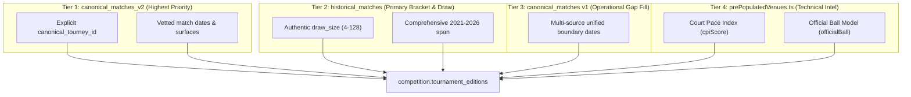

# Phase 4 Target Mapping & Precedence Specification: Tournament Editions

**Branch:** `staging/phase-1-ingestion-spec`  
**Target Table:** `competition.tournament_editions` (Defined in `db/postgres-schema-v1.sql`)  
**Parent Registry:** `identity.tournaments`  
**Target Scope:** Annual editions for calendar years 2021 through 2026  

---

## 1. Explicit Schema Naming & Architectural Resolution

An explicit architectural hierarchy governs tournament master registries and annual instances:
1. **Master Entity:** `identity.tournaments` is the authoritative tournament registry containing persistent series attributes (`tournament_id`, `name_standard`, `tour`, `tour_level`, `default_surface`, `country_ioc`, `city`, `is_indoor`).
2. **Annual Edition Entity:** `competition.tournament_editions` (referred to as `competition.tournamenteditions` in unquoted SQL) contains annual tournament instances, referencing `identity.tournaments(tournament_id)` via foreign key with natural key `UNIQUE (tournament_id, year)`.

---

## 2. Column-by-Column Target Mapping Specification

| Target Column | PostgreSQL Type | Nullable | Primary Source Column | Transformation & Normalization Rule | Fallback Rule | Authoritative? | Conflict Resolution Rule |
| :--- | :--- | :---: | :--- | :--- | :--- | :---: | :--- |
| `edition_id` | `UUID` | **NO** | Derived | Deterministic UUIDv5: `uuidv5('tournament_edition:' + tournament_id + ':' + year, NAMESPACE_TOURNAMENT_EDITIONS)`. | Deterministic synthesis. | **YES** | Primary Key. Invariant across all phases. |
| `tournament_id` | `UUID` | **NO** | Phase 3 `identity.tournaments` | Foreign Key resolving to `identity.tournaments(tournament_id)`. | Must resolve to Phase 3 tournament. | **YES** | Unresolvable candidates quarantined (`phase-4-competition-editions-conflicts.jsonl`). |
| `year` | `SMALLINT` | **NO** | Match date prefix | Integer year in range `[2021, 2026]`: `EXTRACT(YEAR FROM match_date)::SMALLINT`. | Parsed from ISO date prefix `YYYY-`. | **YES** | Enforces check: `year BETWEEN 1968 AND 2040`. |
| `edition_name` | `TEXT` | **NO** | Derived | Standard title: `${tournament.name_standard} ${year}` (e.g. `'Australian Open 2024'`). | Preserves commercial title in provenance. | **YES** | Deterministic title standard. |
| `start_date` | `DATE` | **NO** | Match dates | Earliest proven match date: `min(match_date)` across authoritative match feeds. | Derived from verified match fixtures. | Tier 1 (v2) ➔ Tier 2 (HM) | Earliest valid match date in edition. |
| `end_date` | `DATE` | **NO** | Match dates | Latest proven match date: `max(match_date)` across authoritative match feeds. | Derived from verified match fixtures. | Tier 1 (v2) ➔ Tier 2 (HM) | Must satisfy `end_date >= start_date`. |
| `actual_surface`| `competition.surface_type`| **NO**| Match `surface` | Edition-specific surface: if match fixtures record a valid surface, normalize to Title Case enum (`'Hard'`, `'Clay'`, `'Grass'`, `'Carpet'`). | Fallback to parent `identity.tournaments.default_surface`. | Match Ground Truth | Match fixture surface overrides catalog default (19 overrides). |
| `draw_size` | `SMALLINT` | YES | `historical_matches.draw_size` | Integer bracket size in documented valid range: `[4, 128]`. | `NULL` if unproven, missing, or raw value is `<= 0`. | Tier 2 (HM) | Never synthesize zero (`0`). Check: `draw_size BETWEEN 4 AND 128`. |
| `court_pace_index`| `SMALLINT` | YES | `prePopulatedVenues.ts` | Measured Court Pace Index integer (CPI rating: 10–100). | `NULL` if unmeasured. | Static Intel | Check constraint: `court_pace_index BETWEEN 10 AND 100`. |
| `created_at` | `TIMESTAMPTZ` | **NO** | Ingestion timestamp | ISO UTC timestamptz: `clock_timestamp()`. | System time. | Ingestion Pipeline | Invariant. |

---

## 3. Multi-Source Evidence Precedence Rules

### 3.1 Date Boundary Aggregation
- `start_date`: `min(match_date)` across all available tiers for `(tournament_id, year)`.
- `end_date`: `max(match_date)` across all available tiers for `(tournament_id, year)`.
- Temporal Guarantee: `start_date <= end_date` is mathematically guaranteed for non-empty match sets.

### 3.2 Surface Override Resolution
- If 100% of match fixtures in that calendar year record a specific surface differing from the tournament's `default_surface` (e.g. Charleston 125 recorded as `'CLAY'` while catalog default is `'Hard'`), the edition records `actual_surface = 'Clay'`.
- Exactly 19 valid surface overrides are detected across 2021–2026.

### 3.3 Draw Size Normalization & Zero-Fabrication
- In legacy SQLite (`historical_matches`), placeholder zeros exist.
- **Rule:** If `raw_draw_size <= 0` or missing, `draw_size` **MUST** be emitted as `NULL`.
- **Rule:** Valid tournament draw sizes are accepted only within the range `4 <= draw_size <= 128` (representing 4, 8, 16, 28, 32, 48, 56, 64, 96, 128 player draws).
- Any out-of-range value is sanitized to `NULL` to avoid corrupting modeling and analytics.
