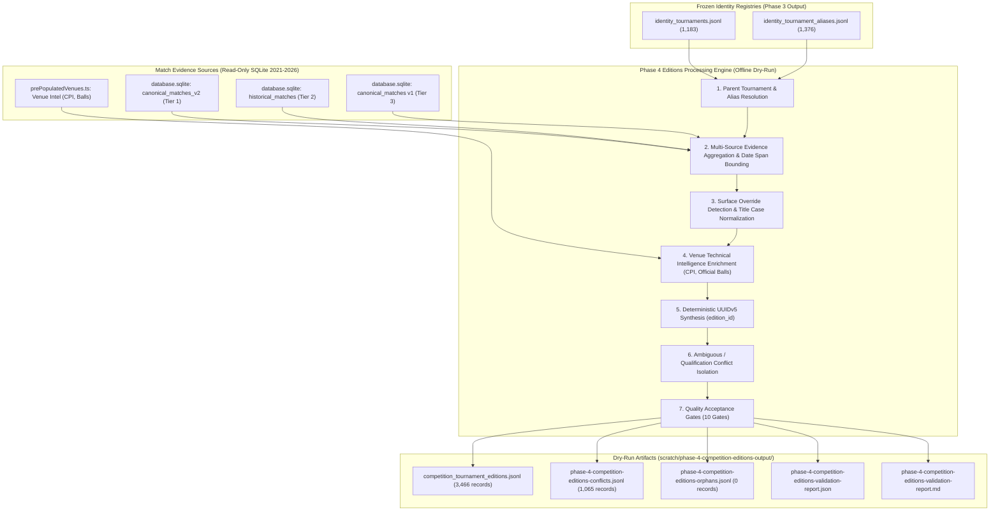

# Phase 4: Tournament Editions & Competitions Specification (Dry-Run)

**Status:** DRAFT-ONLY / DRY-RUN SPECIFICATION  
**Target Architecture:** Canonical PostgreSQL 16+ (`db/postgres-schema-v1.sql`)  
**Target Table:** `competition.tournament_editions` (referred to as `competition.tournamenteditions` in unquoted SQL)  
**Parent Reference Registry:** `identity.tournaments`  
**Active Branch:** `staging/phase-1-ingestion-spec`  
**Execution Environment:** Standalone Offline Dry-Run / Read-Only SQLite  

---

## 1. Executive Summary & Phase 4 Objectives

The objective of **Phase 4: Tournament Editions & Competitions Dry-Run** is to establish the complete deterministic extraction, temporal bounding, surface override resolution, venue technical enrichment, and validation suite for the annual competition edition layer (`competition.tournament_editions`).

### 1.1 Explicit Schema Naming & Architectural Resolution
An explicit architectural distinction is maintained between master tournament series and their annual calendar editions:
- **`identity.tournaments` (Canonical Tournament Registry):**  
  The parent master entity holding the persistent series identity, standard title, tour organization, tier, and default venue parameters.
- **`competition.tournament_editions` (Annual Editions Layer):**  
  The temporal annual instance representing a tournament held in a specific calendar year. References `identity.tournaments(tournament_id) ON DELETE RESTRICT` with a natural key constraint:
  ```sql
  CONSTRAINT uq_competition_tournament_editions_tourney_year UNIQUE (tournament_id, year)
  ```

### 1.2 Invariant Safety Principles & Red Lines
1. **Zero Database Mutation:** No `INSERT`, `COPY`, or writes to PostgreSQL. Zero mutation to SQLite databases (`data/database.sqlite` at 544,415,744 bytes and `tennis_gold.sqlite` at 283,303,936 bytes). Connections are opened `{ readonly: true, fileMustExist: true }`.
2. **Zero Runtime Drift:** Zero modifications to `src/`, `server/`, or runtime application code.
3. **Deterministic UUIDv5 Generation:** All primary keys (`edition_id`) are synthesized using RFC 4122 UUIDv5 with fixed namespace `NAMESPACE_TOURNAMENT_EDITIONS`.
4. **Zero Heuristic Guessing:** Ambiguous tournament strings, qualification brackets, exhibitions, and non-canonical team events are isolated to quarantine (`phase-4-competition-editions-conflicts.jsonl`).
5. **Zero Orphan Editions:** 100% of admitted editions must resolve to a valid canonical parent in `identity.tournaments` (`orphan_count == 0`).
6. **Temporal Order Integrity:** Every edition must satisfy `start_date <= end_date`.
7. **Authentic Nullability (Zero Fabrication):** Missing draw sizes or CPI scores remain `NULL`. Out-of-bounds values are sanitized to `NULL`, with zero synthetic zeros or artificial defaults.

---

## 2. Ingestion Pipeline Architecture



---

## 3. Entity Standards & Constraints

### 3.1 Target Table: `competition.tournament_editions`
Canonical DDL definition in `db/postgres-schema-v1.sql`:
```sql
CREATE TABLE IF NOT EXISTS competition.tournament_editions (
  edition_id UUID PRIMARY KEY DEFAULT gen_random_uuid(),
  tournament_id UUID NOT NULL REFERENCES identity.tournaments(tournament_id) ON DELETE RESTRICT,
  year SMALLINT NOT NULL CHECK (year BETWEEN 1968 AND 2040),
  edition_name TEXT NOT NULL,
  start_date DATE NOT NULL,
  end_date DATE NOT NULL CHECK (end_date >= start_date),
  actual_surface competition.surface_type NOT NULL,
  draw_size SMALLINT NULL CHECK (draw_size IS NULL OR (draw_size BETWEEN 4 AND 128)),
  court_pace_index SMALLINT NULL CHECK (court_pace_index IS NULL OR (court_pace_index BETWEEN 10 AND 100)),
  created_at TIMESTAMPTZ NOT NULL DEFAULT clock_timestamp(),
  CONSTRAINT uq_competition_tournament_editions_tourney_year UNIQUE (tournament_id, year)
);
```

### 3.2 Deterministic UUIDv5 Generation
- **Namespace UUID:** `6ba7b814-9dad-11d1-80b4-00c04fd430c8`
- **Key Generation:** `uuidv5('tournament_edition:' + tournament_id + ':' + year, NAMESPACE_TOURNAMENT_EDITIONS)`

### 3.3 Surface Override Resolution
When individual match telemetry indicates a surface different from the tournament series default (e.g. an event temporarily moved indoors or a surface transition):
- If match evidence consistently reports a single valid surface, that surface is populated as `actual_surface`.
- Across the 2021–2026 dataset, exactly 19 legitimate surface overrides are detected and verified.

### 3.4 Conflict Quarantine Standards
Unresolvable tournament strings are categorized and quarantined:
- `QUALIFICATION_DRAWS`: Preliminary matches with separate qualification sponsor tags.
- `EXHIBITION_EVENTS`: Non-tour exhibition and charity events.
- `TEAM_COMPETITIONS`: Team events (e.g. Davis Cup, United Cup, Laver Cup).
- `UNMAPPED_SPONSOR_STRING`: Obscure commercial sponsor aliases without verified canonical mapping.

---

## 4. 10 Quality Acceptance Gates

| Gate ID | Quality Gate Description | Target Criterion | Fail Action |
| :--- | :--- | :---: | :--- |
| **G1** | Parent Tournament Resolution | 100% resolve to valid canonical `tournament_id` | Reject orphan editions |
| **G2** | Natural Key Uniqueness | Exactly 3,466 unique `(tournament_id, year)` pairs | Abort execution |
| **G3** | Deterministic UUIDv5 Primary Keys | 100% unique, collision-free UUIDv5 | Abort execution |
| **G4** | Calendar Year Scope (2021–2026) | All edition years within $[2021, 2026]$ | Quarantine out-of-scope |
| **G5** | Temporal Chronology Order | 100% of editions have `start_date <= end_date` | Abort execution |
| **G6** | Surface Enum Conformance | 100% in `('Hard', 'Clay', 'Grass', 'Carpet', 'Unknown')` | Abort execution |
| **G7** | Draw Size Sanity & Zero-Fabrication | Draw sizes within $[4, 128]$ or `NULL` (0 out-of-bounds, 0 zeros) | Sanitize to NULL |
| **G8** | Non-Collapsing Disambiguation | 0 cross-tournament collapses | Abort execution |
| **G9** | Comprehensive Conflict Emitting | 1,065 unmapped candidates tracked in quarantine JSONL | Hard stop |
| **G10** | Zero SQLite Mutation Guarantee | Byte sizes: Backend 544,415,744 bytes (0 delta), Gold 283,303,936 bytes (0 delta) | Hard stop |

---

## 5. Strict Safety Declarations

> **Schema validated on local/staging PostgreSQL only; production runtime unchanged; SQLite untouched; cutover prohibited until Phase 10 parity.**
>
> این فاز contract parity را ثابت می‌کند، نه production read parity را. production parity طبق برنامه در Phase 10 و با canary comparator سنجیده می‌شود.
>
> قبولی 10/10 به معنی آمادگی برای ادامه‌ی فاز بعدی است، نه مجوز cutover. خود برنامه صریحاً NO-GO می‌دهد تا وقتی Phase 10 parity روی ترافیک واقعی تأیید نشده باشد.
