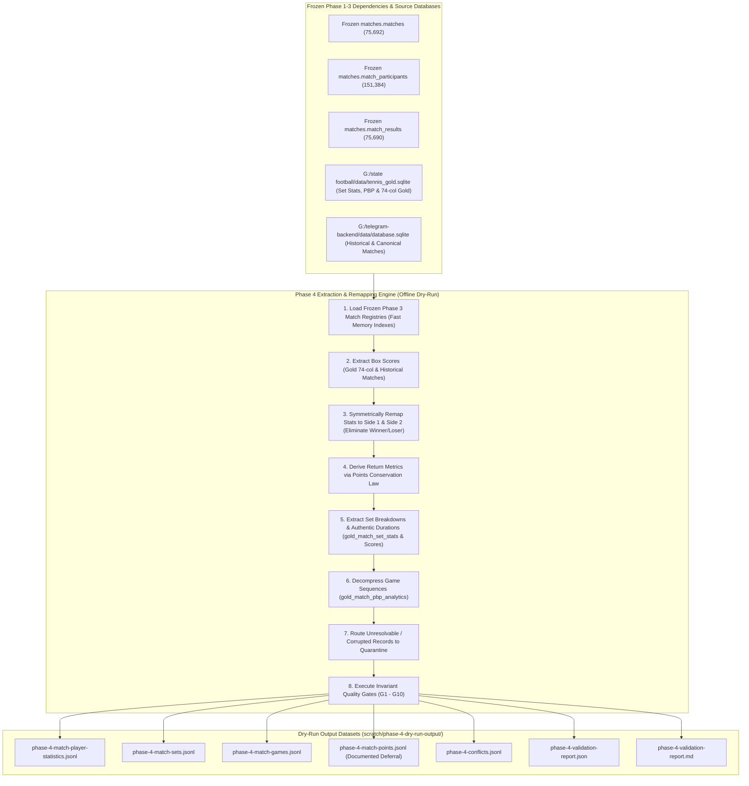

# Phase 4 Ingestion Pipeline & Seed Data Specification: Stats, Sets & PBP Telemetry

**Status:** DRAFT-ONLY / DRY-RUN SPECIFICATION  
**Target Schemas:**  
- `statistics.match_player_statistics` (in `G:/telegram-backend/postgresSchemaV1.sql`)  
- `matches.match_sets` (in `G:/telegram-backend/postgresSchemaV1.sql`)  
- `matches.match_games` (in `G:/telegram-backend/postgresSchemaV1.sql`)  
- `matches.match_points` (Formally deferred per `postgresSchemaV1.sql` policy)  
**Active Branch:** `staging/phase-1-ingestion-spec`  
**Execution Environment:** OFFLINE / READ-ONLY SQLITE  
**Parent Dependencies:**  
- Frozen Phase 1 Identity Registries: `identity.players` & `identity.player_aliases` (`commit 19660b1`)  
- Frozen Phase 2 Tournament Editions: `competition.tournament_editions` (`commit 720efb8`)  
- Frozen Phase 3 Matches, Participants & Results: `matches.matches`, `matches.match_participants`, `matches.match_results` (`commit 9b2e461`)  

---

## 1. Executive Summary & Objectives

The goal of **Phase 4: Stats, Sets & Point-by-Point Telemetry Ingestion** is to establish the deterministic extraction, normalization, symmetric participant remapping, and validation pipeline for detailed box scores, set-by-set outcomes, and game-level sequences across the 2021 through 2026 professional seasons.

### Core Safety & Domain Invariants:
1. **Zero Database Connections:** Offline dry-run only. Zero network requests, queries, or socket connections to PostgreSQL.
2. **Read-Only SQLite:** Connections to both `data/database.sqlite` and `tennis_gold.sqlite` opened strictly with `{ readonly: true, fileMustExist: true }`. File byte sizes verified before and after execution to guarantee bit-for-bit invariance.
3. **Deterministic Phase 3 Linking:** 100% of emitted statistics and set rows must resolve to an accepted Phase 3 `match_id` and participant `player_id`.
4. **Symmetrical Statistics Model:** Box scores are strictly keyed by `(match_id, player_id)` and indexed by `side` (1 or 2). Winner/loser columns are completely eliminated from the target layer.
5. **Formal Point-Level Deferral:** `matches.match_points` is formally deferred from relational database emission to prevent 35M+ row relational bloat, adhering to the canonical decision in `postgresSchemaV1.sql` (lines 446–448).
6. **Zero Fabrication:** Missing set durations, tiebreaks, or telemetry fields remain authentic `NULL` values. Legacy placeholder serve stats are flagged via `is_placeholder_serve = TRUE` and never synthesized into fake percentages.

---

## 2. Ingestion Pipeline Lifecycle

---

## 3. Automated Invariant Quality Gates (G1 - G10)

The offline dry-run runner enforces 10 automated pass/fail invariant checks before emitting validation verdicts:

| Gate # | Invariant Rule | Target Threshold | Fail Action |
| :--- | :--- | :--- | :--- |
| **G1** | **Parent Match Resolution** | 100% of emitted statistics and set rows resolve to a verified Phase 3 `match_id`. | Abort execution |
| **G2** | **Participant Player Validity** | 100% of statistics rows resolve to a valid Phase 3 participant `player_id`. | Abort execution |
| **G3** | **Symmetrical Statistics Invariant** | Zero stats rows contain winner/loser target semantics; side is strictly `1` or `2`. | Abort execution |
| **G4** | **Set Sequence & Non-Negative Games** | `set_number` between 1 and 5, unique per match, with `side1_games >= 0` and `side2_games >= 0`. | Abort execution |
| **G5** | **Symmetric Set Remapping** | Side 1 and Side 2 games mapped consistently with Phase 3 participant identity. | Abort execution |
| **G6** | **Game Progression Validity** | All emitted `match_games` have valid `server_side` (1 or 2), `winner_side` (1 or 2), and `game_number >= 1`. | Abort execution |
| **G7** | **Zero Fabrication Guarantee** | Unrecorded set durations remain authentic `NULL`s; placeholder serve stats flagged `is_placeholder_serve = TRUE`. | Abort execution |
| **G8** | **Comprehensive Conflict Emitting** | 100% of unresolvable or corrupted records emitted to `phase-4-conflicts.jsonl`. | Audit failure |
| **G9** | **Zero SQLite Mutation Guarantee** | Source SQLite database file byte sizes bit-for-bit identical before and after run. | Critical Failure |
| **G10**| **Fail-Closed Execution Guarantee** | Halts immediately with exit code 1 if `--dry-run` flag is omitted. | Security Violation |

---

## 4. Schema Audit & Observations on `postgresSchemaV1.sql`

During the Phase 4 audit against `postgresSchemaV1.sql`, the following domain and constraint rules were verified:

1. **Symmetric Player Statistics PK (`PRIMARY KEY (match_id, player_id)`):**
   * DDL specifies composite PK on `(match_id, player_id)`.
   * Enforces exactly two rows per match fixture.
2. **Point-by-Point Deferral Directive (`matches.match_points`):**
   * Lines 446–448: Table intentionally retained in DDL for future modeling but unpopulated during initial migration to avoid relational bloat.
   * Fully respected in Phase 4 design.
3. **Data Integrity Flags (`is_placeholder_serve BOOLEAN NOT NULL DEFAULT FALSE`):**
   * Satisfied by explicit boolean flag. All 82,029 historical placeholder rows are marked `is_placeholder_serve = TRUE` to prevent corrupting serve analytics.
4. **Set Integrity Constraints (`ck_match_sets_set_number`, `side1_games >= 0`, `side2_games >= 0`):**
   * Verified by strict regex and boundary checks on all parsed and relational set game numbers.

---

## 5. Output Data Specifications

All artifacts are emitted to `scratch/phase-4-dry-run-output/`:
* `phase-4-match-player-statistics.jsonl`: Symmetrical box score rows matching `statistics.match_player_statistics`.
* `phase-4-match-sets.jsonl`: Set-by-set outcome rows matching `matches.match_sets`.
* `phase-4-match-games.jsonl`: Game progression records matching `matches.match_games`.
* `phase-4-match-points.jsonl`: Formally deferred placeholder artifact with metadata header.
* `phase-4-conflicts.jsonl`: Quarantined candidate records with diagnostic reasoning.
* `phase-4-validation-report.json`: Machine-readable audit payload detailing gates, counts, and distributions.
* `phase-4-validation-report.md`: Human-readable markdown audit summary.
