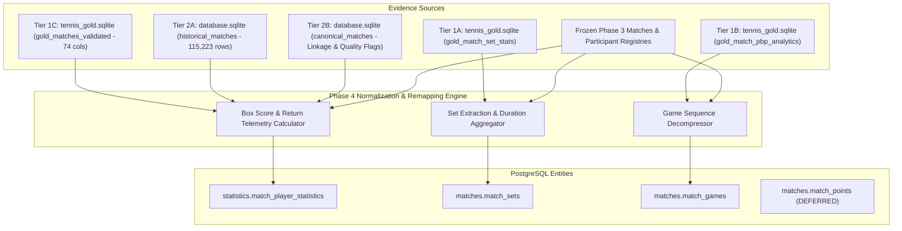

# Phase 4 Target Mapping & Precedence Specification: Stats, Sets & PBP Telemetry

**Branch:** `staging/phase-1-ingestion-spec`  
**Target Tables:**  
- `statistics.match_player_statistics` (Defined in `postgresSchemaV1.sql`)  
- `matches.match_sets` (Defined in `postgresSchemaV1.sql`)  
- `matches.match_games` (Defined in `postgresSchemaV1.sql`)  
- `matches.match_points` (Formally deferred per `postgresSchemaV1.sql` policy)  
**Scope:** Calendar Years 2021 through 2026  

---

## 1. Column-by-Column Target Mapping Specifications

### 1.1 Target Table: `statistics.match_player_statistics`
Granular match box scores per player. Exactly two rows emitted per match (one for `side = 1` / `player1_id`, one for `side = 2` / `player2_id`).

| Target Column | PostgreSQL Type | Nullable | Primary Source Column | Transformation & Normalization Rule | Fallback Rule | Authoritative? |
| :--- | :--- | :--- | :--- | :--- | :--- | :--- |
| `match_id` | `UUID` | **NO** | Frozen Phase 3 Key | Foreign key resolving to `matches.matches(match_id)`. | Invariant link. | **YES** |
| `player_id` | `UUID` | **NO** | Frozen Phase 3 Key | Foreign key resolving to `identity.players(player_id)`. Matches `player1_id` for side 1, `player2_id` for side 2. | Invariant link. | **YES** |
| `side` | `SMALLINT` | **NO** | Symmetrical Index | Integer `1` or `2`. Check constraint: `CHECK (side IN (1, 2))`. | Invariant index. | **YES** |
| `aces` | `SMALLINT` | **NO** | `w_ace` / `l_ace` / `aces` | Total aces served. Mapped to player's side. Defaults to `0`. | Default `0`. | Tier 1 (Gold) ➔ Tier 2 (HM) |
| `double_faults` | `SMALLINT` | **NO** | `w_df` / `l_df` / `double_faults` | Total double faults served. Mapped to player's side. Defaults to `0`. | Default `0`. | Tier 1 (Gold) ➔ Tier 2 (HM) |
| `svpt` | `SMALLINT` | **NO** | `w_svpt` / `l_svpt` | Total service points played by this player. | If unrecorded, default `0`. | Tier 1 (Gold) ➔ Tier 2 (HM) |
| `first_in` | `SMALLINT` | **NO** | `w_1stIn` / `l_1stIn` | Total 1st serves in. | If unrecorded, default `0`. | Tier 1 (Gold) ➔ Tier 2 (HM) |
| `first_won` | `SMALLINT` | **NO** | `w_1stWon` / `l_1stWon` | Total 1st serve points won. | If unrecorded, default `0`. | Tier 1 (Gold) ➔ Tier 2 (HM) |
| `second_won` | `SMALLINT` | **NO** | `w_2ndWon` / `l_2ndWon` | Total 2nd serve points won. | If unrecorded, default `0`. | Tier 1 (Gold) ➔ Tier 2 (HM) |
| `sv_gms` | `SMALLINT` | **NO** | `w_SvGms` / `l_SvGms` | Total service games played. | If unrecorded, default `0`. | Tier 1 (Gold) ➔ Tier 2 (HM) |
| `bp_saved` | `SMALLINT` | **NO** | `w_bpSaved` / `l_bpSaved` | Break points saved on serve. | If unrecorded, default `0`. | Tier 1 (Gold) ➔ Tier 2 (HM) |
| `bp_faced` | `SMALLINT` | **NO** | `w_bpFaced` / `l_bpFaced` | Break points faced on serve. | If unrecorded, default `0`. | Tier 1 (Gold) ➔ Tier 2 (HM) |
| `first_return_won` | `SMALLINT` | **NO** | `w_first_return_won` / Derived | If present in Desktop Gold, mapped directly. Fallback formula: $\text{Opponent.1stIn} - \text{Opponent.1stWon}$. | Derived from opponent serve stats. | Tier 1 (Gold) ➔ Derived |
| `second_return_won` | `SMALLINT` | **NO** | `w_second_return_won` / Derived | If present in Desktop Gold, mapped directly. Fallback formula: $(\text{Opponent.svpt} - \text{Opponent.1stIn}) - \text{Opponent.2ndWon}$. | Derived from opponent serve stats. | Tier 1 (Gold) ➔ Derived |
| `bp_converted` | `SMALLINT` | **NO** | `w_bp_converted` / Derived | Break points converted as receiver: $\text{Opponent.bpFaced} - \text{Opponent.bpSaved}$. | Derived from opponent break points. | Tier 1 (Gold) ➔ Derived |
| `bp_opportunities` | `SMALLINT` | **NO** | Opponent `bpFaced` | Break point opportunities as receiver: equals $\text{Opponent.bpFaced}$. | Derived from opponent break points faced. | Tier 1 (Gold) ➔ Derived |
| `receiver_points_won`| `SMALLINT` | **NO** | `w_receiver_points_won` / Derived | Total points won on return: $\text{Opponent.svpt} - (\text{Opponent.1stWon} + \text{Opponent.2ndWon})$. | Derived from opponent serve points. | Tier 1 (Gold) ➔ Derived |
| `total_points_won` | `SMALLINT` | **NO** | `w_total_points_won` / Derived | Total points won in match: $(\text{Own.1stWon} + \text{Own.2ndWon}) + \text{Own.receiver_points_won}$. | Derived from own serve + return won. | Tier 1 (Gold) ➔ Derived |
| `is_placeholder_serve`| `BOOLEAN` | **NO** | `is_placeholder_serve` | `TRUE` if match has placeholder / corrupted serve telemetry (`svpt == 0` or legacy flag); otherwise `FALSE`. | Default `FALSE`. | **YES** |
| `created_at` | `TIMESTAMPTZ` | **NO** | System timestamp | ISO UTC timestamp (`clock_timestamp()`). | System time. | **YES** |

---

### 1.2 Target Table: `matches.match_sets`
Formal set-by-set breakdown. Between 1 and 5 rows emitted per completed match.

| Target Column | PostgreSQL Type | Nullable | Primary Source Column | Transformation & Normalization Rule | Fallback Rule | Authoritative? |
| :--- | :--- | :--- | :--- | :--- | :--- | :--- |
| `match_id` | `UUID` | **NO** | Frozen Phase 3 Key | Foreign key resolving to `matches.matches(match_id)`. Part of composite PK. | Invariant link. | **YES** |
| `set_number` | `SMALLINT` | **NO** | `set_num` / Parsed order | Integer set index in range `[1, 5]`. Check constraint: `CHECK (set_number BETWEEN 1 AND 5)`. | Parsed sequential index. | **YES** |
| `side1_games` | `SMALLINT` | **NO** | `w_games` / `l_games` / Score | Games won in this set by Side 1 (`player1_id`). Symmetrically remapped from winner/loser games. Check: `CHECK (side1_games >= 0)`. | Parsed from score string. | **YES** |
| `side2_games` | `SMALLINT` | **NO** | `w_games` / `l_games` / Score | Games won in this set by Side 2 (`player2_id`). Symmetrically remapped from winner/loser games. Check: `CHECK (side2_games >= 0)`. | Parsed from score string. | **YES** |
| `tiebreak_score` | `TEXT` | **YES** | Score token | Official tiebreak score representation if set reached tiebreak (e.g. `'7-5'`, `'10-8'`). | `NULL` if no tiebreak was played. Never fabricate. | **YES** |
| `duration_seconds` | `INTEGER` | **YES** | `gold_match_set_stats.duration_seconds` | Authentic recorded duration of this specific set in seconds. Values `<= 0` sanitized to `NULL`. | `NULL` if unrecorded (historical matches without set clock). Never fabricate. | Tier 1 (Gold) |

---

### 1.3 Target Table: `matches.match_games`
Detailed game-by-game progression, service holds/breaks, and deuce game counts. Populated for matches with verified point-by-point telemetry.

| Target Column | PostgreSQL Type | Nullable | Primary Source Column | Transformation & Normalization Rule | Fallback Rule | Authoritative? |
| :--- | :--- | :--- | :--- | :--- | :--- | :--- |
| `match_id` | `UUID` | **NO** | Frozen Phase 3 Key | Foreign key resolving to `matches.matches(match_id)`. Part of composite PK. | Invariant link. | **YES** |
| `set_number` | `SMALLINT` | **NO** | `game_sequence_json.s` | Integer set index in range `[1, 5]`. | Invariant index. | **YES** |
| `game_number` | `SMALLINT` | **NO** | `game_sequence_json.g` | Game index within set starting at 1. Check: `CHECK (game_number >= 1)`. | Invariant index. | **YES** |
| `server_side` | `SMALLINT` | **NO** | `game_sequence_json.srv` | Symmetrically remapped server side (`1` or `2`). Check: `CHECK (server_side IN (1, 2))`. | Derived via Phase 3 participant mapping. | **YES** |
| `winner_side` | `SMALLINT` | **NO** | `game_sequence_json.win` | Symmetrically remapped game winner side (`1` or `2`). Check: `CHECK (winner_side IN (1, 2))`. | Derived via Phase 3 participant mapping. | **YES** |
| `is_break_of_serve`| `BOOLEAN` | **NO** | `game_sequence_json.brk` | `TRUE` if `server_side <> winner_side` (break of serve); `FALSE` on service hold. | Deterministic comparison. | **YES** |
| `point_sequence` | `TEXT` | **NO** | `game_sequence_json.sc` | Recorded terminal score or point progression string (e.g. `'40-15'`, `'40-A'`). | Terminal score representation. | **YES** |
| `deuce_count` | `SMALLINT` | **NO** | `game_sequence_json.deuce` | Number of deuces played in this game. Defaults to `0`. | Default `0`. | **YES** |

---

## 2. Symmetrical Side Remapping Engine

In legacy stores, box scores, set results, and PBP metrics are recorded with respect to the match winner (`w_*`) and match loser (`l_*`). To eliminate target lookahead leakage, Phase 4 strictly remaps all fields to `side = 1` and `side = 2` using the frozen Phase 3 participant ordering:

$$\text{winner\_is\_side\_1} = (\text{winner\_player\_id} == \text{player1\_id})$$

### 2.1 Remapping Matrix

| Metric Category | Target Side 1 (`player1_id`) Formula | Target Side 2 (`player2_id`) Formula |
| :--- | :--- | :--- |
| **Aces** | `winner_is_side_1 ? w_aces : l_aces` | `winner_is_side_1 ? l_aces : w_aces` |
| **Double Faults** | `winner_is_side_1 ? w_df : l_df` | `winner_is_side_1 ? l_df : w_df` |
| **Service Points (`svpt`)** | `winner_is_side_1 ? w_svpt : l_svpt` | `winner_is_side_1 ? l_svpt : w_svpt` |
| **1st Serve In (`first_in`)** | `winner_is_side_1 ? w_1stIn : l_1stIn` | `winner_is_side_1 ? l_1stIn : w_1stIn` |
| **1st Serve Won (`first_won`)**| `winner_is_side_1 ? w_1stWon : l_1stWon` | `winner_is_side_1 ? l_1stWon : w_1stWon` |
| **2nd Serve Won (`second_won`)**| `winner_is_side_1 ? w_2ndWon : l_2ndWon` | `winner_is_side_1 ? l_2ndWon : w_2ndWon` |
| **Service Games (`sv_gms`)** | `winner_is_side_1 ? w_SvGms : l_SvGms` | `winner_is_side_1 ? l_SvGms : w_SvGms` |
| **Break Points Saved (`bp_saved`)**| `winner_is_side_1 ? w_bpSaved : l_bpSaved` | `winner_is_side_1 ? l_bpSaved : w_bpSaved` |
| **Break Points Faced (`bp_faced`)**| `winner_is_side_1 ? w_bpFaced : l_bpFaced` | `winner_is_side_1 ? l_bpFaced : w_bpFaced` |
| **Set Games (`side1_games`, `side2_games`)** | `winner_is_side_1 ? w_games : l_games` | `winner_is_side_1 ? l_games : w_games` |
| **Game Server Side (`server_side`)** | `srv == 1 ? (winner_is_side_1 ? 1 : 2) : (winner_is_side_1 ? 2 : 1)` | Invariant side indicator. |
| **Game Winner Side (`winner_side`)** | `win == 1 ? (winner_is_side_1 ? 1 : 2) : (winner_is_side_1 ? 2 : 1)` | Invariant side indicator. |

---

## 3. Mathematical Proof of Return Statistics Derivation

When precalculated return telemetry is absent (such as in legacy Sackmann `historical_matches` files), return metrics are derived using the conservation of points law in tennis:

1. **First Return Points Won:**
   $$\text{Return.first\_return\_won} = \text{Opponent.first\_in} - \text{Opponent.first\_won}$$
2. **Second Return Points Won:**
   $$\text{Second Serves In} = \text{Opponent.svpt} - \text{Opponent.first\_in}$$
   $$\text{Return.second\_return\_won} = \text{Second Serves In} - \text{Opponent.second\_won}$$
3. **Break Points Converted & Opportunities:**
   $$\text{Return.bp\_opportunities} = \text{Opponent.bp\_faced}$$
   $$\text{Return.bp\_converted} = \text{Opponent.bp\_faced} - \text{Opponent.bp\_saved}$$
4. **Receiver Points Won:**
   $$\text{Return.receiver\_points\_won} = \text{Opponent.svpt} - (\text{Opponent.first\_won} + \text{Opponent.second\_won})$$
5. **Total Points Won:**
   $$\text{Total.points\_won} = (\text{Own.first\_won} + \text{Own.second\_won}) + \text{Own.receiver\_points\_won}$$

---

## 4. Multi-Source Evidence Precedence Hierarchy

---

## 5. Deferral Specification for `matches.match_points`

1. **Schema Context:** `matches.match_points` is defined in `postgresSchemaV1.sql` (lines 444–462).
2. **Design Rule:** The table is intentionally excluded from relational JSONL emission in Phase 4.
3. **Artifact Behavior:** The dry-run runner outputs `phase-4-match-points.jsonl` as an empty artifact accompanied by a structured metadata header in `phase-4-validation-report.md` confirming deferral.
4. **Physical Lineage:** 58,131 raw match bundles remain preserved in `data/bulk-match-bundles/events/<rapid_event_id>/point_by_point.json` for specialized offline Markov research without impacting core relational database migration.
