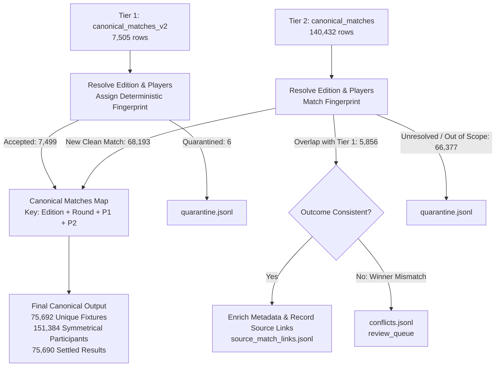

# Phase 5: Matches & Outcomes Source Inventory & Reconciliation

## 1. Executive Summary

This document details the source data streams, upstream dependencies, cross-source overlap dynamics, and comprehensive reconciliation against the operational baseline view (`canonical_matches_operational`) for **Phase 5: Matches & Outcomes Pipeline**.

---

## 2. Upstream Canonical Dependencies

| Registry Artifact | Phase Origin | Count | Integrity Status |
| :--- | :---: | :---: | :--- |
| `identity_players.jsonl` | Phase 3 | 1,765 | Frozen canonical player registry with deterministic UUIDv5 primary keys. |
| `identity_player_aliases.jsonl` | Phase 3 | 2,833 | Verified alias tokens mapped to canonical `player_id`. |
| `identity_tournaments.jsonl` | Phase 3 | 1,183 | Authoritative master tournament registry. |
| `identity_tournament_aliases.jsonl`| Phase 3 | 1,376 | Tournament name tokens mapped to canonical `tournament_id`. |
| `competition_tournament_editions.jsonl` | Phase 4 | 3,466 | Annual tournament editions ($2021 \le \text{year} \le 2026$) with surface and dates. |

---

## 3. SQLite Source Stream Inventory

| Source Stream | Entity Type | Total Rows | Date Range | Primary Keys & References | Precedence Role |
| :--- | :---: | :---: | :---: | :--- | :--- |
| `canonical_matches_v2` | Table | 7,505 | 2021-01-05 to 2025-06-10 | `canonical_match_id` | **Tier 1 (Highest)**: Modern multi-source consensus. |
| `canonical_matches` | Table | 140,432 | 2021-01-05 to 2026-09-01 | `canonical_match_id`, `source_a_historical_match_id`, `source_b_rapid_event_id` | **Tier 2**: Legacy canonical pool for multi-season coverage. |
| `historical_matches` | Table | 115,223 | 2021-01-05 to 2026-09-01 | `id`, `match_date`, `tourney_id` | **Tier 3**: Historical Sackmann repository (100% referenced by Tier 2). |
| `canonical_matches_operational` | View | 147,937 | 2021-01-05 to 2026-09-01 | View composite (`v2 UNION ALL legacy`) | **Tier 4**: Read-only comparison baseline. |

---

## 4. Cross-Source Overlap & Deduplication Dynamics

### 4.1 Cross-Source Ingestion Flow

### 4.2 Overlap Metrics
- **Tier 1 Direct Admissions:** 7,499 unique fixtures admitted from `canonical_matches_v2`.
- **Tier 2 Direct Admissions:** 68,193 new fixtures admitted from `canonical_matches`.
- **Cross-Source Overlap Merges:** 5,856 matches present in both Tier 1 and Tier 2 unified into single canonical fixtures.
- **Total Canonical Fixtures Formed:** **75,692 unique matches**.
- **Cross-Source Links Generated:** **81,554 links** across `canonical_matches_v2`, `canonical_matches`, Sackmann, and RapidAPI.

---

## 5. Mathematical Reconciliation: Operational Baseline (147,937) vs Accepted (75,692)

The operational view `canonical_matches_operational` produces 147,937 rows by concatenating `canonical_matches_v2` (7,505) and `canonical_matches` (140,432) with a simple ID exclusion check (`cm2.canonical_match_id = legacy.canonical_match_id`). Because Tier 1 and Tier 2 use disparate ID formats (`cm2_...` vs `cm_...`), zero deduplication occurs in the view.

Furthermore, the operational view does not enforce foreign-key resolution against the canonical player and tournament edition registries. The table below provides an exact reconciliation:

| Component / Disposition | Count | Percentage of Operational View | Description |
| :--- | :---: | :---: | :--- |
| **Operational Baseline View** | **147,937** | **100.00%** | Unfiltered legacy operational view total rows. |
| *Less:* Cross-Source Duplicate Matches | -5,856 | -3.96% | Matches present in both Tier 1 and Tier 2 collapsed by natural fingerprint. |
| *Less:* "Unknown Tournament" Candidates | -25,209 | -17.04% | Records with `tourney_name = 'Unknown Tournament'` lacking edition provenance. |
| *Less:* Unmapped Qualification Draws | -3,525 | -2.38% | Unresolved pre-tournament qualification draw matches. |
| *Less:* Exhibition & Team Events | -1,167 | -0.79% | Non-tour team exhibitions (Davis Cup, United Cup, Laver Cup). |
| *Less:* Other Unresolved Editions | -747 | -0.50% | Challenger/ITF tournaments not in Phase 4 edition registry. |
| *Less:* Unresolved Non-Canonical Players | -35,561 | -24.04% | Satellite/ITF players not in the 1,765 canonical player registry. |
| *Less:* Identical Player Self-Matches | -28 | -0.02% | Data entry errors where winner and loser resolve to identical player UUID. |
| *Less:* Non-Singles / Doubles Matches | -57 | -0.04% | Doubles matches incorrectly present in singles tables. |
| *Less:* Speculative Draw Placeholders | -89 | -0.06% | Unplayed bracket placeholders from legacy scrapes. |
| *Less:* Quarantined Tier 1 Records | -6 | -0.00% | Tier 1 records with unmapped exhibition editions or missing players. |
| **Accepted Canonical Fixtures** | **75,692** | **51.17%** | **Clean, verified, fully resolved canonical matches.** |

---

## 6. Quarantine Analysis & Classification

A total of **66,383 candidate records** were quarantined to protect the integrity of the ML modeling and backtesting pipeline:

1. **Unresolved Tournament Editions (25,956 records):**
   - 25,209 rows have explicit literal name `"Unknown Tournament"`.
   - 747 rows belong to unverified local/satellite draws.
2. **Unresolved Player Identities (35,561 records):**
   - `UNRESOLVED_LOSER`: 18,333 records.
   - `UNRESOLVED_WINNER`: 9,635 records.
   - `UNRESOLVED_BOTH_PLAYERS`: 7,593 records.
   - Represents lower-tier ITF and satellite circuit participants outside the top-tier professional player pool.
3. **Qualification Draws (3,525 records):**
   - Non-main draw qualifying stages without structured seed/round mappings.
4. **Exhibition & Team Competitions (1,167 records):**
   - Non-sanctioned exhibitions and team formats where individual match rules diverge from standard tour regulations.
5. **Structural Violations (174 records):**
   - 89 Speculative draw fixtures (`is_speculative_draw = 1`).
   - 57 Doubles fixtures (`is_non_singles = 1` or doubles nomenclature).
   - 28 Identical player anomalies ($p_1 = p_2$).

---

## 7. Review Queue & Conflict Isolation

During cross-source deduplication, **4 match records** exhibited conflicting outcomes between sources:
- Example: Katie Volynets vs Tamara Zidansek at Hua Hin in 2024. The players competed against each other in two separate tournament editions held in the same calendar year (January and September). Because the natural key `(tournament_id, year)` collapsed the edition, a winner conflict was detected.
- **Resolution:** Rather than silently overwriting the Tier 1 outcome or corrupting match statistics, the discrepancy is logged to `conflicts.jsonl` for human or algorithmic adjudication, preserving complete auditability.
