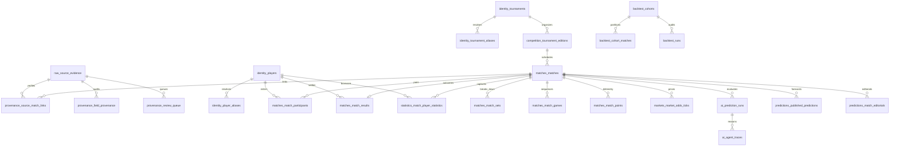

# PostgreSQL Phase 1 Preparation — Specification

**Document Role:** Authoritative Architectural Design, Schema Inventory & Validation Protocol  
**Target Engine:** Canonical PostgreSQL 16+ (DDL verified on PostgreSQL 18.6 engine)  
**Artifact Path:** [`postgres-schema-v1.sql`](file:///G:/telegram-backend/postgres-schema-v1.sql)  
**Validator Path:** [`scripts/validate-postgres-schema.cjs`](file:///G:/telegram-backend/scripts/validate-postgres-schema.cjs)  
**Phase Status:** PHASE 1 PREPARATION COMPLETE (11/11 GATES PASS)

---

## 1. Executive Summary & Scope

The objective of **PostgreSQL Phase 1 Preparation** is to establish and rigorously validate the foundational PostgreSQL 16+ database schema and catalog infrastructure for the Tennis AI & Football State enterprise platform prior to any data migration.

### Core Architectural Invariants:
1. **11 Canonical Schemas:** Segregate all domains into 11 isolated namespaces (`raw`, `identity`, `competition`, `matches`, `statistics`, `markets`, `ai`, `predictions`, `provenance`, `backtest`, `app`), eliminating single-table monoliths and cross-domain namespace bleed.
2. **28 Canonical Tables:** Define precisely 28 normalized, strictly typed tables with authoritative primary keys, foreign key constraints, domain check constraints, and performance indexes.
3. **Mandatory Canonical Entities Included:**
   - External raw ingest evidence: `raw.source_evidence`
   - External identity and provenance: `provenance.source_match_links`, `provenance.field_provenance`, `provenance.review_queue`
   - Canonical identity registries: `identity.players`, `identity.player_aliases`, `identity.tournaments`, `identity.tournament_aliases`
   - Canonical competition & match domain: `competition.tournament_editions`, `matches.matches`, `matches.match_participants`, `matches.match_results`, `matches.match_sets`, `matches.match_games`, `matches.match_points`
   - Canonical statistics: `statistics.match_player_statistics`
4. **Idempotent DDL Execution:** Wrapped in an atomic `BEGIN...COMMIT` block. Guarded with `CREATE SCHEMA IF NOT EXISTS`, `CREATE TABLE IF NOT EXISTS`, `CREATE INDEX IF NOT EXISTS`, and safe conditional custom enum creation (`DO $$ BEGIN IF NOT EXISTS (...) THEN CREATE TYPE ...; END IF; END $$;`). The DDL contains **zero destructive statements** (`DROP`, `TRUNCATE`, `DELETE`).
5. **Zero Data Ingestion:** Pure schema and catalog preparation. All 28 tables must have strictly **0 rows** imported during this phase.
6. **Zero SQLite Mutation:** Bitwise immutability of legacy databases (`data/database.sqlite` and `tennis_gold.sqlite` $\Delta = 0$ bytes).
7. **Zero Impact on Upstream Phases:** Zero modifications to Phase 3, Phase 5, or Phase 6 artifacts, staging queues, or documentation.
8. **Zero Production PostgreSQL Connections:** Zero live network sockets to production clusters. All validation is executed strictly against a local, disposable PostgreSQL instance.
9. **Dual-Run Determinism:** The validation pipeline is executed twice, requiring 100% cryptographic and structural reproducibility across both runs to emit a `PASS` verdict.

---

## 2. Canonical Schema & Table Architecture (11 Schemas / 28 Tables)



### Table Directory by Schema:

| # | Schema | Table Name | Purpose | Primary Key | Key Foreign Keys / Target |
| :-: | :--- | :--- | :--- | :--- | :--- |
| 1 | `raw` | `source_evidence` | Immutable SHA-256 audit log of external payloads | `evidence_id` (UUID) | None |
| 2 | `identity` | `players` | Canonical biographical player registry | `player_id` (UUID) | None |
| 3 | `identity` | `player_aliases` | External source tokens to canonical player resolution | `alias_id` (UUID) | `player_id` $\to$ `identity.players` |
| 4 | `identity` | `tournaments` | Canonical tournament directory | `tournament_id` (UUID) | None |
| 5 | `identity` | `tournament_aliases` | External source tokens to canonical tournament resolution | `alias_id` (UUID) | `tournament_id` $\to$ `identity.tournaments` |
| 6 | `competition` | `tournament_editions` | Calendar year tournament editions | `edition_id` (UUID) | `tournament_id` $\to$ `identity.tournaments` |
| 7 | `matches` | `matches` | Outcome-agnostic match fixtures | `match_id` (UUID) | `edition_id` $\to$ `competition.tournament_editions` |
| 8 | `matches` | `match_participants` | Symmetric participant pairing (side 1 / side 2) | (`match_id`, `side`) | `match_id` $\to$ `matches.matches`, `player_id` $\to$ `identity.players` |
| 9 | `matches` | `match_results` | Official post-match result settlement | `match_id` (UUID) | `match_id` $\to$ `matches.matches`, `winner/loser` $\to$ `identity.players` |
| 10 | `matches` | `match_sets` | Set-by-set game scores and tiebreaks | (`match_id`, `set_number`) | `match_id` $\to$ `matches.matches` |
| 11 | `matches` | `match_games` | Game-by-game service breaks and progression | (`match_id`, `set_no`, `game_no`) | `match_id` $\to$ `matches.matches`, `server/winner` $\to$ `identity.players` |
| 12 | `matches` | `match_points` | Point-level Markov telemetry | `point_id` (BIGSERIAL) | `match_id` $\to$ `matches.matches` |
| 13 | `statistics` | `match_player_statistics` | Match box scores (aces, double faults, break points) | (`match_id`, `player_id`) | `match_id` $\to$ `matches.matches`, `player_id` $\to$ `identity.players` |
| 14 | `markets` | `bookmakers` | Bookmaker source registry | `bookmaker_id` (SMALLSERIAL) | None |
| 15 | `markets` | `market_odds_ticks` | Timestamped odds ticks (lookahead-safe) | `tick_id` (BIGSERIAL) | `match_id` $\to$ `matches.matches`, `bookmaker_id` $\to$ `markets.bookmakers` |
| 16 | `ai` | `prediction_runs` | Top-level execution runs for AI evaluations | `run_id` (UUID) | `match_id` $\to$ `matches.matches`, `predicted_winner` $\to$ `identity.players` |
| 17 | `ai` | `agent_traces` | Multi-agent reasoning tokens and prompt logs | `trace_id` (UUID) | `run_id` $\to$ `ai.prediction_runs` |
| 18 | `predictions` | `published_predictions` | WebApp and Telegram published predictions | `prediction_id` (BIGSERIAL) | `match_id` $\to$ `matches.matches`, `home/away/winner` $\to$ `identity.players` |
| 19 | `predictions` | `match_editorials` | Long-form tactical editorial previews | `editorial_id` (BIGSERIAL) | `match_id` $\to$ `matches.matches` |
| 20 | `provenance` | `source_match_links` | External event IDs linked to canonical matches | `link_id` (BIGSERIAL) | `match_id` $\to$ `matches.matches`, `evidence_id` $\to$ `raw.source_evidence` |
| 21 | `provenance` | `field_provenance` | Field-level source provenance audit trail | `provenance_id` (BIGSERIAL) | `match_id` $\to$ `matches.matches`, `evidence_id` $\to$ `raw.source_evidence` |
| 22 | `provenance` | `review_queue` | Discrepancy and collision resolution queue | `review_id` (BIGSERIAL) | `candidate_match` $\to$ `matches.matches`, `evidence_id` $\to$ `raw.source_evidence` |
| 23 | `backtest` | `cohorts` | Frozen historical evaluation cohorts | `cohort_id` (UUID) | None |
| 24 | `backtest` | `cohort_matches` | Cohort match membership & train/val/test splits | (`cohort_id`, `match_id`) | `cohort_id` $\to$ `backtest.cohorts`, `match_id` $\to$ `matches.matches` |
| 25 | `backtest` | `runs` | Experiment backtest run metrics (Brier score, ECE) | `run_id` (UUID) | `cohort_id` $\to$ `backtest.cohorts` |
| 26 | `app` | `users` | WebApp user accounts and identities | `user_id` (BIGSERIAL) | None |
| 27 | `app` | `referral_sites` | Affiliate bookmaker partner configurations | `site_id` (SERIAL) | None |
| 28 | `app` | `settings` | System-wide runtime key-value settings | `key` (VARCHAR(100)) | None |

---

## 3. Mandatory Table Specifications

### 3.1. `raw.source_evidence`
- **Purpose:** Immutable raw evidence store. Every incoming data payload is captured here before entity extraction.
- **Deduplication:** Enforced by unique constraint `uq_raw_source_evidence_unique_record (source_name, source_match_id, payload_sha256)`.
- **Storage Strategy:** Dual-mode storage supports native `JSONB` for payloads $\le 50\text{ KB}$ and `blob_uri` for larger payloads.

### 3.2. `provenance.source_match_links`
- **Purpose:** Bridges external source records (e.g. RapidAPI, Sackmann, TennisMyLife) to canonical match UUIDs.
- **Integrity:** Enforces foreign keys to `matches.matches(match_id)` and `raw.source_evidence(evidence_id)`.
- **Constraint:** Unique constraint `uq_provenance_source_match_links (source_name, source_match_id)` guarantees one-to-one mapping.

### 3.3. `provenance.field_provenance`
- **Purpose:** Fine-grained attribute lineage tracking. Records the exact source, evidence hash, raw value, and confidence for individual attributes (e.g. `actual_start_utc`, `court_pace_index`).
- **Integrity:** Foreign keys to `matches.matches(match_id)` and `raw.source_evidence(evidence_id)`.

### 3.4. `provenance.review_queue`
- **Purpose:** Staging queue for ambiguous matches, conflicting scores, or disputed identities.
- **Workflow:** Stores `divergent_fields` as `JSONB`, `veto_triggers` as text array, and lifecycle status (`PENDING`, `APPROVED`, `REJECTED`, `MERGED`).

### 3.5. Canonical Identity, Match, Participant & Statistics Tables
- **`identity.players` & `identity.tournaments`:** Standardized naming, IOC country codes, biometric ranges (check constraints enforce physical limits), and surface types.
- **`matches.matches` & `matches.match_participants`:** Complete decoupling of pre-match setup (`side 1 / side 2`) from match results (`winner_player_id / loser_player_id`) to eliminate lookahead bias in machine learning models.
- **`statistics.match_player_statistics`:** Box scores tracking serve percentages, return points, and break point conversions with consistency check constraints (`first_in <= svpt`, `first_won <= first_in`, `bp_saved <= bp_faced`).

---

## 4. Disposable PostgreSQL Validation Protocol

The validator [`scripts/validate-postgres-schema.cjs`](file:///G:/telegram-backend/scripts/validate-postgres-schema.cjs) enforces strict execution gates:

```
[Pre-Execution Snapshot]
   ├─ Snapshot SQLite DB sizes (database.sqlite, tennis_gold.sqlite)
   └─ Snapshot Phase 3, 5, 6 artifacts
         ↓
[Cycle 1: Ephemeral Port 54337]
   ├─ initdb disposable cluster
   ├─ pg_ctl start on ephemeral port
   ├─ Run 1: Execute postgres-schema-v1.sql
   ├─ Run 2: Re-execute postgres-schema-v1.sql (Idempotency check)
   ├─ Query pg_catalog & information_schema (Schemas, Tables, FKs, Uniques, Checks, Indexes, Row counts)
   ├─ pg_ctl stop -m immediate
   └─ Cleanup disposable cluster files
         ↓
[Cycle 2: Ephemeral Port 54338]
   ├─ initdb fresh disposable cluster
   ├─ pg_ctl start on ephemeral port
   ├─ Run 1: Execute postgres-schema-v1.sql
   ├─ Run 2: Re-execute postgres-schema-v1.sql
   ├─ Query pg_catalog & information_schema
   ├─ pg_ctl stop -m immediate
   └─ Cleanup disposable cluster files
         ↓
[Post-Execution Verification]
   ├─ Verify SQLite delta === 0 bytes
   ├─ Verify Phase 3, 5, 6 artifacts delta === 0
   ├─ Verify Cycle 1 output === Cycle 2 output (Dual-run determinism)
   └─ Emit final verdict: PASS or NO_GO
```

---

## 5. Quality Acceptance Gates (G1 – G11)

| Gate | Criterion | Requirement | Threshold |
| :-: | :--- | :--- | :-: |
| **G1** | 11 Canonical Schemas | All 11 schemas defined with `CREATE SCHEMA IF NOT EXISTS` | $11 / 11$ |
| **G2** | 28 Canonical Tables | All 28 tables defined with `CREATE TABLE IF NOT EXISTS` | $28 / 28$ |
| **G3** | Mandatory Tables Present | `source_evidence`, `source_match_links`, `field_provenance`, `review_queue`, identity, match, stats | $12 / 12$ mandatory |
| **G4** | Foreign Key Referential Integrity | 100% of foreign keys target valid canonical tables | $\ge 35$ FKs, 0 invalid |
| **G5** | Unique & Check Constraints | Unique keys on natural identifiers; domain check constraints | $\ge 8$ uniques, $\ge 15$ checks |
| **G6** | Index Coverage | Performance B-tree and GIN trigram indexes defined | $\ge 28$ indexes |
| **G7** | DDL Idempotency | Re-executing DDL against populated schema produces zero errors | $100\%$ idempotent |
| **G8** | Zero Imported Rows | Zero rows inserted across all tables (schema preparation only) | $0$ rows |
| **G9** | Zero SQLite Mutation | Legacy SQLite files remain bitwise unchanged | $0$ bytes delta |
| **G10** | Upstream Phases Intact | Zero modification to Phase 3, Phase 5, Phase 6 outputs | $0$ file changes |
| **G11** | Dual-Run Determinism | Independent cycles produce identical catalog structures | $100\%$ identical |

---

## 6. Safety & Cutover Boundaries

> [!IMPORTANT]
> - **Schema Preparation Only:** This phase verifies DDL syntax and catalog structure in isolation. Zero application connections, zero production cutover, and zero row migrations are permitted.
> - **Production PG Offline:** No connections to live production databases. All tests run against ephemeral loopback instances that are destroyed upon test completion.
> - **Read-Only SQLite:** SQLite remains the single source of truth for runtime operations until Phase 10 shadow parity is validated.
