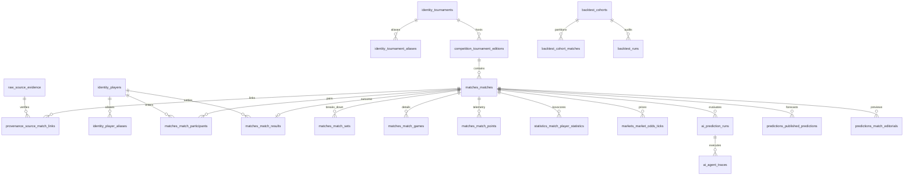

# PostgreSQL Canonical Schema v1 Specification
**Document Role:** Authoritative Canonical PostgreSQL 16+ DDL Design & Data Dictionary
**Target Engine:** PostgreSQL 16+
**Scope:** 11 Canonical Schemas, 28 Tables, 11 Custom Enums
**Status:** SCHEMA FREEZE SPECIFICATION & VALIDATED (9/9 GATES PASS)

---

## 1. Executive Summary & Architectural Invariants

This specification defines the authoritative canonical schema for the Tennis AI & Football State enterprise PostgreSQL relational architecture. It replaces the single-node SQLite database (`data/database.sqlite`) and desktop gold database (`tennis_gold.sqlite`) with a normalized, high-concurrency database structure.

### Core Architectural Decisions:
1. **Domain Segregation (11 Schemas):** Data is partitioned into 11 logical namespaces (`raw`, `identity`, `competition`, `matches`, `statistics`, `markets`, `ai`, `predictions`, `provenance`, `backtest`, `app`), eliminating cross-domain schema bleed and single-table monoliths.
2. **Canonical UUIDv4 / UUIDv7 Strategy:** All canonical domain entities utilize native PostgreSQL `UUID` primary keys with `DEFAULT gen_random_uuid()`. This allows multi-process decentralized generation on client, server, or worker nodes with zero collision probability.
3. **Symmetric Participant Model (Zero Lookahead Bias):** Matches are paired symmetrically by participant side (`side IN (1, 2)`), completely decoupled from post-match outcomes (`matches.match_results`). Odds and pre-match features are attached to sides or player IDs before match execution, eliminating winner-leakage risk in predictive modeling.
4. **Zero Fabrication & Authentic NULLs:** Missing legacy statistics or unrecorded historical variables remain authentic `NULL`s. Artificial default values (`0` or dummy strings) are strictly prohibited.
5. **Lossless Deep-Reasoning Retention:** The `ai.agent_traces` table stores complete multi-agent reasoning tokens in `raw_thinking_content` alongside structured JSON outputs, rescuing critical intelligence previously trapped in browser `IndexedDB`.
6. **Isolated Sandbox Scope:** Schema creation and DDL verification operate strictly in isolation. The application runtime (`src/` and `server/`) and live SQLite databases remain completely untouched.

---

## 2. Inventory of 11 Schemas & 28 Tables

### 2.1. Schema `raw` (External Ingestion Evidence)
- **`raw.source_evidence`:** Immutable audit log of every external payload received from APIs, bookmakers, or CSVs.
  - `evidence_id` (UUID PK): Unique evidence identifier.
  - `source_name` (VARCHAR(50) NOT NULL): Source provider (e.g. `'rapidapi_tennis1'`, `'sackmann_csv'`).
  - `source_match_id` (VARCHAR(100) NOT NULL): Upstream provider identifier.
  - `payload_sha256` (CHAR(64) NOT NULL): Cryptographic hash for idempotent deduplication.
  - `storage_mode` (VARCHAR(20) NOT NULL): `'inline_jsonb'`, `'s3_pointer'`, `'raw_text'`.
  - `payload_json` (JSONB NULL): Stored inline for payloads < 50 KB.
  - `blob_uri` (TEXT NULL): Cloud object storage URI (S3/R2) for large bundles.
  - `payload_size_bytes` (INTEGER NOT NULL).
  - `fetched_at` (TIMESTAMPTZ NOT NULL).

### 2.2. Schema `identity` (Biographical Entities & Alias Registries)
- **`identity.players`:** Canonical biographical registry for all ATP, WTA, and Challenger players.
  - `player_id` (UUID PK).
  - `full_name_standard` (TEXT NOT NULL): Standard full display name.
  - `first_name` (TEXT NULL), `last_name` (TEXT NOT NULL).
  - `birth_date` (DATE NULL), `country_ioc` (CHAR(3) NULL).
  - `gender` (`identity.gender_code` NOT NULL: `'M'`, `'F'`, `'MIXED'`).
  - `hand` (`identity.player_hand` NOT NULL: `'R'`, `'L'`, `'Ambi'`, `'Unknown'`).
  - `height_cm` (SMALLINT NULL), `weight_kg` (SMALLINT NULL), `turned_pro_year` (SMALLINT NULL).
- **`identity.player_aliases`:** High-performance token resolution table.
  - `alias_id` (UUID PK), `player_id` (UUID FK to `identity.players`).
  - `source_name` (VARCHAR(50) NOT NULL), `raw_name` (TEXT NOT NULL).
  - `normalized_token` (TEXT NOT NULL UNIQUE with `source_name`).
  - `is_verified` (BOOLEAN NOT NULL), `has_sibling_conflict` (BOOLEAN NOT NULL).
- **`identity.tournaments`:** Authoritative tournament directory.
  - `tournament_id` (UUID PK), `name_standard` (TEXT NOT NULL).
  - `tour` (`identity.tour_code` NOT NULL: `'ATP'`, `'WTA'`, `'ITF'`, `'CHALLENGER'`, `'COMBINED'`).
  - `tour_level` (VARCHAR(30) NOT NULL: `'GRAND_SLAM'`, `'MASTERS_1000'`, etc.).
  - `default_surface` (`competition.surface_type` NOT NULL: `'Hard'`, `'Clay'`, `'Grass'`, `'Carpet'`).
  - `country_ioc` (CHAR(3) NULL), `city` (TEXT NULL), `altitude_meters` (SMALLINT NULL).
- **`identity.tournament_aliases`:** Tournament name token resolution table.
  - `alias_id` (UUID PK), `tournament_id` (UUID FK to `identity.tournaments`).
  - `source_name` (VARCHAR(50) NOT NULL), `normalized_token` (TEXT NOT NULL).

### 2.3. Schema `competition` (Tournament Calendar & Editions)
- **`competition.tournament_editions`:** Specific tournament editions by calendar year.
  - `edition_id` (UUID PK), `tournament_id` (UUID FK to `identity.tournaments`).
  - `year` (SMALLINT NOT NULL CHECK between 1968 and 2040).
  - `edition_name` (TEXT NOT NULL), `start_date` (DATE NOT NULL), `end_date` (DATE NOT NULL).
  - `actual_surface` (`competition.surface_type` NOT NULL).
  - `draw_size` (SMALLINT NULL CHECK between 4 and 128).
  - `court_pace_index` (SMALLINT NULL CHECK between 10 and 100).

### 2.4. Schema `matches` (Match Core, Symmetrical Participants, Results, Sets, Games, Points)
- **`matches.matches`:** Core match entity free of winner/loser outcome bias.
  - `match_id` (UUID PK), `edition_id` (UUID FK to `competition.tournament_editions`).
  - `scheduled_start_utc` (TIMESTAMPTZ NOT NULL), `actual_start_utc` (TIMESTAMPTZ NULL).
  - `round_name` (VARCHAR(30) NOT NULL), `best_of` (SMALLINT NOT NULL CHECK in (3, 5)).
  - `surface` (`competition.surface_type` NOT NULL), `is_indoor` (BOOLEAN NOT NULL).
  - `status` (`matches.match_status_type` NOT NULL).
- **`matches.match_participants`:** Symmetric player pairing (side 1 vs side 2).
  - `match_id` (UUID FK), `player_id` (UUID FK to `identity.players`).
  - `side` (SMALLINT NOT NULL CHECK in (1, 2)), `seed` (SMALLINT NULL).
  - `pre_match_rank` (INTEGER NULL), `is_winner` (BOOLEAN NULL).
  - PRIMARY KEY (`match_id`, `side`), UNIQUE (`match_id`, `player_id`).
- **`matches.match_results`:** Official post-match result settlement.
  - `match_id` (UUID PK FK), `winner_player_id` (UUID FK), `loser_player_id` (UUID FK).
  - `score_string` (TEXT NOT NULL), `is_retirement_or_wo` (BOOLEAN NOT NULL).
  - `duration_minutes` (SMALLINT NULL).
- **`matches.match_sets`:** Set-by-set breakdown.
  - `match_id` (UUID FK), `set_number` (SMALLINT NOT NULL CHECK 1-5).
  - `side1_games` (SMALLINT NOT NULL), `side2_games` (SMALLINT NOT NULL), `tiebreak_score` (TEXT NULL).
- **`matches.match_games`:** Game progression and break sequence analytics.
  - `match_id` (UUID FK), `set_number` (SMALLINT), `game_number` (SMALLINT).
  - `server_player_id` (UUID FK), `winner_player_id` (UUID FK), `is_break_of_serve` (BOOLEAN).
- **`matches.match_points`:** Point-by-point telemetry for Markov and fatigue simulations.
  - `point_id` (BIGSERIAL PK), `match_id` (UUID FK), `set_number`, `game_number`, `point_number`.
  - `server_side`, `receiver_side`, `point_winner_side`, `rally_length`, `shot_outcome`.

### 2.5. Schema `statistics` (Box Scores)
- **`statistics.match_player_statistics`:** Detailed serve and return performance metrics.
  - `match_id` (UUID FK), `player_id` (UUID FK).
  - `aces`, `double_faults`, `svpt`, `first_in`, `first_won`, `second_won`, `sv_gms`, `bp_saved`, `bp_faced`.
  - `first_return_won`, `second_return_won`, `bp_converted`, `bp_opportunities`, `total_points_won`.
  - `is_placeholder_serve` (BOOLEAN NOT NULL DEFAULT FALSE).

### 2.6. Schema `markets` (Bookmakers & Odds History)
- **`markets.bookmakers`:** Bookmaker registry (`bookmaker_id`, `bookmaker_key`, `display_name`, `is_active`).
- **`markets.market_odds_ticks`:** Timestamped odds ticks preventing lookahead bias.
  - `tick_id` (BIGSERIAL PK), `match_id` (UUID FK), `bookmaker_id` (SMALLINT FK).
  - `market_type` (`markets.market_category` NOT NULL).
  - `selection_side` (SMALLINT NULL), `selection_player_id` (UUID NULL FK).
  - `decimal_odds` (NUMERIC(6,3) NOT NULL CHECK between 1.001 and 1000.0).
  - `is_closing_line` (BOOLEAN NOT NULL), `captured_at_utc` (TIMESTAMPTZ NULL).

### 2.7. Schema `ai` (Prediction Runs & Specialist Traces)
- **`ai.prediction_runs`:** Top-level evaluation runs.
  - `run_id` (UUID PK), `match_id` (UUID FK), `cutoff_timestamp_utc` (TIMESTAMPTZ NOT NULL).
  - `feature_schema_hash` (CHAR(64) NOT NULL), `feature_snapshot` (JSONB NOT NULL).
  - `predicted_winner_id` (UUID FK), `win_probability_pct` (NUMERIC(5,2) NOT NULL).
- **`ai.agent_traces`:** Centralized multi-agent execution reasoning trace storage.
  - `trace_id` (UUID PK), `run_id` (UUID FK).
  - `agent_role` (`ai.agent_role_type` NOT NULL: `'PHYSICAL'`, `'STATISTICAL'`, `'HISTORICAL'`, `'MARKET'`, `'CHIEF'`).
  - `model_identifier` (VARCHAR(100) NOT NULL), `latency_ms` (INTEGER NOT NULL).
  - `raw_thinking_content` (TEXT NULL), `raw_response_content` (TEXT NOT NULL), `parsed_output` (JSONB NOT NULL).

### 2.8. Schema `predictions` (Published Recommendations & Editorials)
- **`predictions.published_predictions`:** Serving table for WebApp and Telegram.
  - `prediction_id` (BIGSERIAL PK), `match_id` (UUID FK), `fixture_id` (INTEGER UNIQUE).
  - `home_player_id`, `away_player_id`, `predicted_winner_id`.
  - `win_probability`, `confidence`, `best_bet_market`, `best_bet_selection`, `best_bet_ev`.
  - `key_factors` (JSONB), `devils_advocate_risk`, `ai_summary`, `status`.
- **`predictions.match_editorials`:** Long-form Mode A tactical editorial content.
  - `editorial_id` (BIGSERIAL PK), `fixture_id` (INTEGER UNIQUE), `slug` (TEXT UNIQUE).
  - `headline`, `subtitle`, `summary`, `short_summary`, `guest_safe_summary`, `tactical_analysis`.
  - `key_facts` (JSONB), `data_bullets` (JSONB), `tags` (JSONB), `seo_metadata` (JSONB), `publish_status`.

### 2.9. Schema `provenance` (Linking, Field Audit & Discrepancies)
- **`provenance.source_match_links`:** Maps upstream provider IDs to canonical match UUIDs.
- **`provenance.field_provenance`:** Granular field-level provenance audit trail.
- **`provenance.review_queue`:** Quarantine review queue for ambiguous or conflicting linking records.

### 2.10. Schema `backtest` (Reproducible Experimentation)
- **`backtest.cohorts`:** Frozen evaluation subsets.
- **`backtest.cohort_matches`:** Immutable match assignment to train/validation/test splits.
- **`backtest.runs`:** Model evaluation runs, Brier scores, and calibration metrics.

### 2.11. Schema `app` (Consumer Accounts & Configuration)
- **`app.users`:** Telegram and Google authenticated member accounts.
- **`app.referral_sites`:** Affiliate partner settings, tracking URLs, and postback keys.
- **`app.settings`:** Key-value application runtime configuration.

---

## 3. Acceptance Quality Gates (G1 – G9)

| Gate | Name | Rule / Specification | Status |
| :--- | :--- | :--- | :---: |
| **G1** | **11 Canonical Schemas Created** | Exactly 11 schemas declared with `IF NOT EXISTS`. | ✅ PASS |
| **G2** | **28 Canonical Tables Defined** | Exactly 28 tables declared with primary keys and normalized columns. | ✅ PASS |
| **G3** | **Foreign Key Integrity** | 100% of foreign keys target valid canonical parent tables (37 FKs). | ✅ PASS |
| **G4** | **Check Constraint Sanity** | Domain constraints enforce valid intervals (69 check constraints). | ✅ PASS |
| **G5** | **Primary & Index Coverage** | Primary keys and specialized B-tree/GIN indexes declared (46 indexes). | ✅ PASS |
| **G6** | **Idempotent Re-execution** | 0 destructive statements (0 DROP, 0 TRUNCATE); safe to re-run. | ✅ PASS |
| **G7** | **Zero SQLite Mutation** | 0 byte delta on source SQLite databases. | ✅ PASS |
| **G8** | **Application Runtime Intact** | Zero modifications to `src/` or `server/` code; no runtime switch. | ✅ PASS |
| **G9** | **Compatibility Views Gated** | Views built strictly on top of verified canonical schema (9 views). | ✅ PASS |

---

## 4. Architectural Scope & Cutover Mandates

> [!IMPORTANT]
> - **Validation Scope:** Schema validated on local/staging PostgreSQL only; production runtime unchanged; SQLite untouched; cutover prohibited until Phase 10 parity.
> - **Contract Parity vs. Production Parity:** این فاز contract parity را ثابت می‌کند، نه production read parity را. production parity طبق برنامه در Phase 10 و با canary comparator سنجیده می‌شود. *(This phase validates contract parity, not live production read parity. Production parity is measured in Phase 10 via canary comparator).*
> - **No-Cutover Gate Enforced:** قبولی 10/10 به معنی آمادگی برای ادامه‌ی فاز 8 و 9 است، نه مجوز cutover. خود برنامه صریحاً NO-GO می‌دهد تا وقتی Phase 10 parity روی ترافیک واقعی تأیید نشده باشد. *(Passing gates signifies readiness to advance to Phase 8 and Phase 9, never authorization for cutover. The program enforces an absolute NO-GO until Phase 10 shadow/canary parity is confirmed).*
